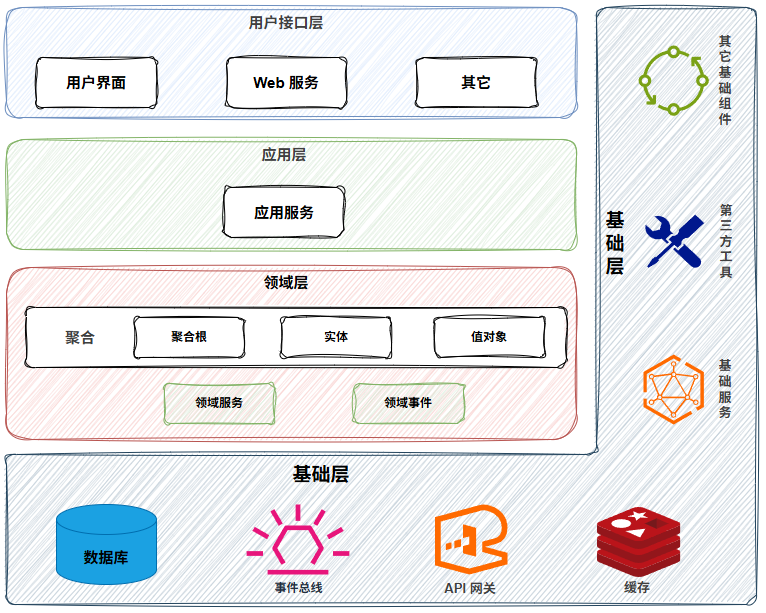
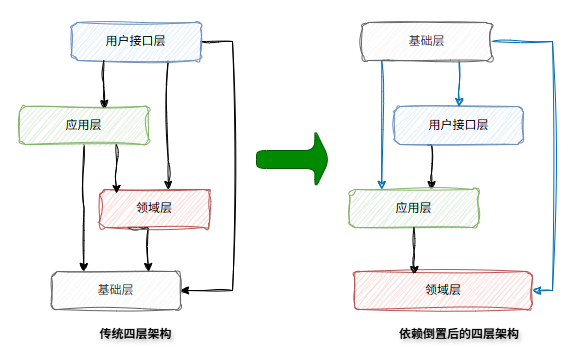

## 前言

在学习了 DDD（领域驱动设计，Domain Driven Design）后，对 DDD 这一领域建模方法论有了更深的理解。不过与其说是方法论，笔者更认为是一种系统设计方面的指导思想，其价值在于，即便不进行全面的 DDD 重构，依然能借鉴其核心原则，对现有系统进行精准而有效的优化。

在经历了单体应用、微服务/分布式系统的研发后，笔者见到很多业务系统在需求的快速迭代下，最终都陷入了代码野蛮生长、模块边界模糊、微服务名存实亡的困境。倘若从项目伊始，便能遵循一种统一的设计哲学去建模与实现，构建一个灵活且可持续演进的架构，那么在应对层出不穷的需求变更时，无疑会更加从容和优雅。

然而 DDD 的成功落地并非易事，它对团队的综合素养提出了较高的要求。从构建通用语言、精炼领域模型，到最终的代码实现，每一个环节都考验着团队对业务本质与 DDD 思想的深刻理解。若缺乏这份理解便匆忙动手，忽视其背后的「战略设计」思想，便极易陷入“为了 DDD 而 DDD”的技术陷阱，其结果往往是创造出一个披着 DDD 外衣的传统三层架构。

本文旨在梳理学习 DDD 过程的笔记，记录各个核心知识点的理解，而真正的应用还是要在日常研发中多从 DDD 的思想角度出发，去思考、设计与实践。

## 学习资料推荐

### 书籍

- 《[中台架构与实现：基于 DDD 和微服务](https://book.douban.com/subject/35235992/)》欧创新、邓頔
- 《[实现领域驱动设计](https://book.douban.com/subject/25844633/)》沃恩·弗农
- 《[领域驱动设计](https://book.douban.com/subject/5344973/)》埃文斯

笔者主要阅读的是《中台架构与实现：基于DDD和微服务》，此书笔者觉得比较适合国人阅读，其从零开始，对 DDD 的各个概念都有讲解，并搭配业务案例以 DDD 实现，能更好的理解 DDD 对系统设计带来的改变和好处。后两本是 DDD 领域的红蓝皮书，是 DDD 概念和实战方面的权威之作，可以搭配着阅读。

### 博客

- [领域驱动设计在互联网业务开发中的实践](https://tech.meituan.com/2017/12/22/ddd-in-practice.html) - 美团技术团队
- [DDD 落地指南 - 架构师眼中的餐厅](https://mp.weixin.qq.com/s/_gAd5F8cXopYuuMdWPCmug) - 京东科技技术说
- Thoughtworks 洞见
  - [DDD 的哲学意味（上）](https://mp.weixin.qq.com/s/cNaQF4RwnF5A4vTT1pCL8A)
  - [DDD 的哲学意味（中）](https://mp.weixin.qq.com/s/A1M2x8nlZgj8oy9UYgSrSw)
  - [DDD 的哲学意味（下）](https://mp.weixin.qq.com/s/CfuI-6aGn7gc6vbq2DbJVQ)

### 视频

- 《[1-熊锐- DDD 的理解及实践探讨](https://www.bilibili.com/video/BV1pG4y167jF/?spm_id_from=333.788.recommend_more_video.-1)》
- 《[2-王吕松- DDD 在点评交易系统演进中的应用](https://www.bilibili.com/video/BV1nt4y1J7hH/?spm_id_from=333.788.recommend_more_video.-1)》
- 《[3-吴仁润- DDD 分层架构实践](https://www.bilibili.com/video/BV1AV4y1p7j7/?spm_id_from=333.1387.search.video_card.click)》
- 《[4-何正- DDD 在美团B端营销系统的实践](https://www.bilibili.com/video/BV1xV4y1H7Zq/?spm_id_from=333.1387.search.video_card.click)》

以上四个视频都由美团技术团队发布，侧重于 DDD 的实践，可以在理解了 DDD 的核心知识后观看。

### 开源框架

- [Axon](https://github.com/AxonFramework/AxonFramework)：Axon Framework 是一个基于领域驱动设计（DDD）、命令查询职责分离（CQRS）和事件源原则构建进化、事件驱动的微服务系统的框架
  - [AxonBank](https://github.com/AxonFramework/AxonBank)：基于银行业务的 Axon 框架应用示例
- [COLA](https://github.com/alibaba/COLA)：COLA 是阿里开源的「整洁面向对象分层架构」，其按照 DDD 思想设计模块，专注于以业务为核心，解耦外部依赖，分离业务复杂度和技术复杂度等，同时还提供了可落地的工具和实践指导

## 笔记

### 基础概念

**领域**（Domain）：即特定的范围或区域。DDD 中会对业务进行领域（范围）划分，然后将问题限定在特定的边界内，在该边界内建立领域模型，从而解决相应业务问题。简言之，DDD 领域即边界内要解决的业务问题域。

**子域**：领域的划分，会形成不同子域，分为以下三类：

- *核心子域*：决定产品核心竞争力的功能子域
- *通用子域*：没有太多个性化需求，同时又被其它子域重复使用的通用功能子域
- *支撑子域*：是产品所必需的，但不决定产品核心竞争力，也不容易被其他子域复用的功能子域

**事件风暴工作坊**（Event Storming Workshop）：以 DDD 为核心，基于事件（Event）的协作式建模技术。通过识别和排序业务领域中发生的「领域事件」来揭示业务流程、发现聚合、实体和限界上下文。

**通用语言**（Ubiquitous Language）：定义上下文对象的含义，在事件风暴过程中，通过团队交流达成共识的，能够简单、清晰、准确地描述业务含义和规则的语言。

**限界上下文**（Bounded Context）：确定领域边界，确保上下文对象在特定的边界内具有唯一含义，以便组合这些对象构建领域模型。限界上下文定义了一个没有语义二义性的业务边界，这个边界既是业务领域的边界，也是微服务拆分的逻辑边界。限界上下文之间也存在映射关系，如下：

- *合作关系*（Partnership）：两个上下文紧密合作的关系，一荣俱荣，一损俱损
- *共享内核*（Shared Kernel）：两个上下文依赖部分共享的模型
- *客户方-供应方开发*（Customer-Supplier Development）：上下文之间有组织的上下游依赖
- *遵奉者*（Conformist）：下游上下文只能盲目依赖上游上下文
- *防腐层*（Anticorruption Layer）：也叫适配层，一个上下文通过一些适配和转换与另一个上下文交互
- *开放主机服务*（Open Host Service）：定义一种协议来让其他上下文来对本上下文进行访问
- *发布语言*（Published Language）：通常与 OHS 一起使用，用于定义开放主机的协议
- *大泥球*（Big Ball of Mud）：混杂在一起的上下文关系，边界不清晰
- *另谋他路*（SeparateWay）：两个完全没有任何联系的上下文

### 分层架构



**用户接口层**：负责与外部系统（用户）交互，接受请求和展示响应数据，这里的用户可能是用户、程序、自动化测试和批处理脚本等。该层的存在使得面对不同的前端应用时，能灵活适配不同业务的需求（数据适配），并且不影响核心业务逻辑（领域层、应用层）。该层主要有以下内容：

- Facade 服务：门面服务，封装应用服务，适配不同前端应用的集成技术体系，提供不同类型的服务接口适配
- Assembler 数据组装：用户接口层会根据不同前端应用的数据要求组装数据，完成前端 DTO 和后端 DO 对象的转化操作，按需提供数据适配

**应用层**：连接用户接口层和领域层，主要职能是协调领域层多个聚合（领域服务），面向业务流程完成服务的组合和编排。

- 应用层主要包含应用服务、事件订阅与发布等相关代码逻辑；也可以进行安全认证、权限校验、事务控制等

**领域层**：实现领域模型的核心业务逻辑。这一层聚集了领域模型的聚合、聚合根、实体、值对象、领域服务和事件等领域对象，通过各领域对象的协同和组合形成领域模型的核心业务能力。

**基础层**：为其他各层提供通用的技术和基础服务，包括第三方工具、驱动、消息中间件、网关、文件、缓存以及数据库等。常见的功能是完成实体的数据库持久化（仓储实现）。

### 领域模型

**领域模型**（Domain Model）是特定业务领域的抽象表示，是业务的核心逻辑和规则的体现。其由多种基础领域对象（Domain Object，DO）构成，而领域对象持久化到数据库时，名称和状态可能发生变化，此时会将领域对象转化为持久化对象（Persistent Object，PO）。

#### 聚合

**实体**（Entity）：当对象具有唯一标识符，并且标识符在历经各种状态变更后仍能保持一致的即为实体。实体即业务对象，集业务属性、行为为一体；在代码上表现为实体类，类中有属性和方法，与实体相关的业务逻辑都在类中方法实现（充血模型）。

**值对象**（Value Object，VO）：是通过对象属性值来识别的对象，它将多个不可修改的相关属性组合为一个概念整体，用于描述领域的某个特定方面，并且是一个没有标识符的对象。在持久化时，值对象不会作为单独的数据表存在，而是属于实体表的一个 JSON 字段（对象）或冗余的列（对象字段，不推荐），以此优化数据表设计和减少联表操作。

**聚合**（Aggregate）：由业务和逻辑紧密关联的实体和值对象组成。聚合定义了一个事务（一致性）边界，聚合内数据的修改必须由聚合根同一组织，聚合是数据修改和持久化的基本单元。

**聚合根**（Aggregate Root）：又称根实体，聚合根是实体；同时在聚合内负责协调实体和值对象，按照固定的业务规则，协同完成聚合共同的业务逻辑；并且是聚合对外的访问对象，聚合之间以聚合根 ID 关联的方式接受聚合的外部请求。但聚合外部对象不能直接通过对象引用的方式访问聚合内的对象，而应当通过应用服务调用。

##### 聚合设计模式

- **仓储模式**（Repository Mode）：主要完成领域对象持久化，一个聚合会有一个仓储，由其统一完成聚合数据的持久化。领域层只需将 DO 转为 PO，然后传递给仓储接口，通过仓储实现完成 DO 持久化。
  - *仓储接口*：面向领域层提供基础层数据处理相关的访问接口，属于领域层
  - *仓储实现*：完成仓储接口对应的数据持久化相关的逻辑处理，属于基础设施层
- **工厂模式**（Factory Mode）：主要用于聚合领域对象的创建和数据初始化。

#### 领域服务

**领域服务**（Domain Service）属于领域层，主要负责封装核心业务逻辑，特别是当一个业务逻辑需要同一个聚合内的多个实体或实体方法协同完成时；它处理的是单个聚合内部无法由实体自身完成的复杂业务行为，若一个业务场景需要同一个聚合内的 2~n 个实体共同完成，这段业务逻辑就可以用领域服务来组合两个实体完成。

之所以不用领域服务来组合多个聚合的协同，是为了实现聚合的高内聚，防止领域服务变得臃肿；其次是为了避免架构演进时，聚合拆分重组出现的问题，如同一限界上下文内的多个聚合拆分为多个微服务导致的引用依赖问题。因此跨聚合组合的行为应该交给应用服务。

#### 领域事件

**领域事件**（Domain Event）表示领域中发生的事件，该事件会导致进一步的业务操作，在实现领域模型解耦的同时，还有助于形成完整的业务操作闭环。

领域事件采用*事件驱动架构*（Event-Driven Architecture，EDA）设计，可切断领域模型之间的强依赖关系，在事件发布后，发布方无需关系订阅者是否处理成功。

领域事件一般结合消息中间件和事件发布订阅的异步处理方式，实现数据最终一致性。采用最终一致性是因为基于聚合的一个设计原则：在边界之外使用最终一致性。

领域事件可以发生在微服务的聚合之间，或微服务之间。

领域事件至少包含：事件唯一标识（全局 ID）、发生时间、事件源、事件发生背景相关的业务数据。

### 应用服务

**应用服务**（Application Service）属于应用层，跨多个聚合的业务逻辑的组合与编排，通过应用服务来实现；不同聚合之间的协同操作要注意入参尽量通过 ID、参数方式传递，而不是直接传递引用对象（避免依赖问题）。

### 领域模型模式

**充血模型**（Rich Domain Model）：在充血模型中，业务逻辑都在领域实体对象中实现，实体本身不仅包含了属性，还包含了它的业务行为。

**贫血模型**（Anemic Domain Model）：此类领域对象大多只有 setter/getter 方法，业务逻辑统一放在业务逻辑层实现，而不是在领域对象中实现；贫血领域对象（Anemic Domain Object）就是指仅用作数据载体，而没有行为和动作的领域对象，简单说就是只有属性没有任何函数的类。

**失血模型**：比贫血模型更糟糕的一种情况，不仅领域对象缺乏业务行为，其对应的业务逻辑层也未能清晰表达业务流程，更多只是对数据持久层方法的调用。

**胀血模型**：指过度膨胀的充血模型，在该模型下的领域对象，通常包括了不属于实体自身职责的属性与业务逻辑，导致实体变得过于庞大复杂，职责不清晰。

### 依赖原则



DDD 分层架构依赖原则：每层只能与位于其下方的层发生耦合。

根据耦合的紧密程度可以分为两种架构模式：

- *严格分层架构*：指任何层只能对位于其直接下方的层产生依赖，即依赖倒置后的四层架构
- *松散分层架构*：允许某层与其任意下方的层发生依赖，即传统架构

在传统松散分层架构，由于能够调用任意下方的层级，会导致职责混淆。如：

- 比如用户接口层可能直接调用领域层的实体方法，甚至尝试修改实体状态，这打破了「应用层是业务用例协者」的原则
- 业务逻辑分散，如果用户接口层可以调用领域层，那么应用层的一些协调逻辑就可能被用户接口层绕过，导致业务逻辑分散在多个地方

在严格分层架构，用户接口层 -> 应用层 -> 领域层是单向依赖，使得每层职责清晰。依赖倒置下，高层模块不依赖低层模块，两者都依赖抽象。如：

- 领域层定义了仓储接口，而基础层负责具体的仓储实现，基础层依赖领域层定义的接口
- 基础层可提供事件发布、文件读写、事务处理等操作，如事务处理应该依赖于具体框架的实现，所以放在基础层，而应用层只需要知道事务的概念

### DDD 设计下的微服务代码结构

```txt
.
├── interfaces
│   ├── assembler
│   ├── dto
│   └── facade
├── application
│   ├── event
│   │   ├── publish
│   │   └── subscribe
│   └── service
├── domain
│   ├── aggregate1
│   │   ├── entity
│   │   ├── event
│   │   ├── repository
│   │   └── service
│   └── aggregate2
│   │   ├── ... ...
│   └── ... ...
└── infrastructure
    ├── config
    └── util
        ├── dao
        ├── api
        ├── driver
        ├── eventbus
        ├── mq
        └── ... ...
```

#### interfaces（用户接口层）

- *assembler*：实现 DTO 与 DO 之间的相互转换和数据交换
- *dto*：是前端应用数据传输的载体，不实现任何业务逻辑
- *facade*：是前端应用数据传输的载体，不实现任何业务逻辑

#### application（应用层）

*event*（事件）

- *publish*：存放事件发布相关代码
- *subscribe*：存放事件订阅相关代码
- 事件处理相关的核心业务逻辑在领域层实现

*service*（应用服务）

- 应用服务会对多个领域服务或其他微服务的应用服务进行封装、编排和组合，对外提供粗粒度的服务，可为每个聚合的应用服务设计一个应用服务类
- 也可能包含 assembler、dto 对象，因为应用层跨微服务调用需要 DTO 与 DO 互转
- 对于多表关联的复杂查询，此类一般是为了前端数据的展示，而不需要有领域逻辑和业务规则约束，可以放在应用层而不是领域层（避免污染领域模型业务）

#### domain（领域层）

*aggregate1*（聚合）

- *entity*：存放聚合根、实体和值对象等相关代码，若实体和值对象过多，可增加子目录用以区分
- *event*：存放事件实体以及与事件活动相关的业务逻辑代码
- *repository*
  - 存放仓储服务（接口与实现）、PO 和持久化逻辑（DAO 等）相关代码
  - 一个聚合只能有一个仓储
  - 为何仓储实现可以考虑直接放在领域层？
    - 为了微服务架构演进时保证聚合代码重组的便利，因为仓储与聚合总是一对一关系，两者组合在一起，就是一个包含领域逻辑和基础层数据处理逻辑的聚合代码单元，一旦领域模型发生变化，当聚合需要在不同的限界上下文或微服务之间进行代码重组时，可以以聚合代码包为单元进行整体拆分或迁移，轻松实现微服务架构演进
    - 这种方式打破了严格依赖倒置原则和分层纯粹性，因为领域层需要包含基础层的代码。但这也是工程实践中的权衡与取舍，毕竟没有「银弹」
    - 从整个微服务角度看，将两者放在一起，它仍然是一个内聚的单元
- *service*
  - 存放领域服务、工厂（factory）服务等相关代码，工厂模式主要负责实体的创建、初始化、 DO 与 PO 对象的互转
  - 聚合内所有领域服务都可放在一个领域服务类，若部分业务逻辑相对复杂，也可分为多个领域服务类实现，避免单类代码臃肿

*aggregate2*（聚合）：其它聚合

#### infrastructure（基础层）

- *config*：存放配置相关代码
- *util*：主要存放平台、开发框架、消息、数据库、缓存、文件、总线、网关、第三方类库和通用算法等基础代码，可以为不同资源类别建立不同的子目录。
  - dao：仓储实现，包含 PO、持久化操作，以及 PO 转为领域对象等相关逻辑
  - api
  - driver
  - eventbus
  - mq
  - ...
