## 流水线 Pipeline

### 概念

**[Jenkins Pipeline](https://www.jenkins.io/doc/book/pipeline/)**（简称 Pipeline/流水线）是一套插件，支持实现*持续交付管道*（CDP，continuous delivery pipelines）并将其集成到 Jenkins 中。

> [!TIP]
> **CDP** 是将软件从版本控制系统直接交付给客户的流程的自动化表达。对软件的每项更改（在源代码管理中提交）在发布过程中都会经历一个复杂的过程，此过程涉及以可靠且可重复的方式构建软件，以及通过测试和部署的多个阶段来推进构建的软件。

Pipeline 的定义会写在一个文本文件，即 **Jenkinsfile**，其可以随着代码一起提交到源代码仓库，是 **Pipeline-as-code** 的基础，此行为将 CDP 视为要像任何其他代码一样进行版本控制和审核。

- **Pipeline**：是用户定义的 CD 管道模型，Pipeline 的代码定义了整个构建过程，其中通常包括构建、测试然后交付应用程序的阶段。pipeline 块也是[声明式管道语法](#声明式管道语法)的一部分
- **Node**（节点）：是 Jenkins 环境的一部分，即能够执行 Pipeline 的机器（详见[控制器隔离](#控制器隔离)）。node 块也是[脚本式管道语法](#脚本式管道语法)的一部分
- **Stage**（阶段）：用于定义 Pipeline 各个阶段的任务子集（比如*构建、测试、部署*阶段），许多插件依赖于 Stage 来可视化 Pipeline 的状态或过程
- **Step**（步骤）：指定 Jenkins 在每个阶段里要执行什么操作

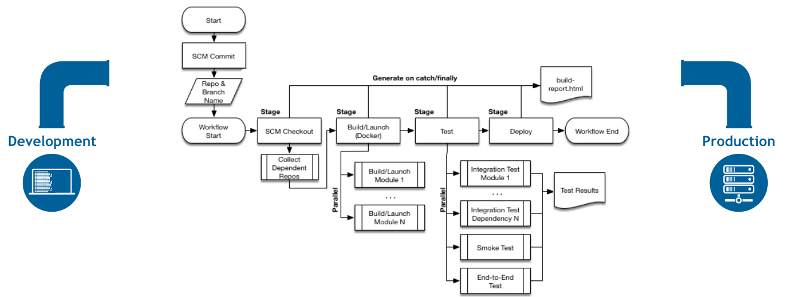

### Jenkinsfile 语法概览

语法分为两种：**声明式**（Declarative）、**脚本式**（Scripted），两者都是 DSL（Pipeline domain-specific language）语言，虽然两者会被 Pipeline 引擎基于 Groovy 语法解析，但是声明式语法是一种更具结构化和限制性的 DSL，其存在是为了能更方便地编写 jenkinsfile，因此无法像脚本式一样能使用 Groovy 绝大多数特性（变量、函数、控制流语句等），两者语法具体比较可看官方文档[说明](https://www.jenkins.io/doc/book/pipeline/syntax/#compare)。

在[操作演示](#操作演示)一节会细讲常用的语法关键词，官方文档直通车戳[这里](https://www.jenkins.io/doc/book/pipeline/syntax/)。

#### 声明式管道语法

```groovy
pipeline {                    // 声明式语法开头
    agent any                 // agent 指定执行此 Pipeline 的节点
    stages {                  // 阶段块
        stage('Build') {      // 为阶段命名
            steps {           // 步骤块
                sh 'make'     // 这里假设执行 bash 命令
                // ... 其它步骤
            }
        }
        stage('Test') {       // 可定义多个阶段
            steps {
                // ... 其它步骤
            }
        }
        stage('Deploy') { 
            steps {
                // ... 其它步骤
            }
        }
    }
}
```

#### 脚本式管道语法

```groovy
node {                    // 脚本式语法开头，表示在任何可用的节点上执行此 Pipeline
    stage('Build') {      // 指定阶段名称
        //                // 执行步骤
    }
    stage('Test') {       // 其它阶段
        // 
    }
    stage('Deploy') { 
        // 
    }
}
```

### 操作演示

> [!NOTE]
> 默认读者已经安装并运行 Jenkins，并能正确访问 Jenkins GUI。启动方式可看官文：[安装 Jenkins](https://www.jenkins.io/doc/book/installing/)。

#### 创建 pipeline

创建流水线有两种方式：传统 GUI 和 [Blue Ocean](https://www.jenkins.io/doc/book/blueocean/)，后者是针对 Pipeline 的 新 GUI 设计，主要提供易于使用的 Pipeline 可视化。由于操作演示专注于 Jenkinsfile 的编写，所以流水线创建方式不再强调（PS：Blue Ocean 支持以可视化的方式创建 Jenkinsfile）。

1. 进入 Jenkins GUI *Dashboard => New Item* 界面，选择 *Pipeline*，输入名称，点击 OK 即可创建流水线项目
2. 进入配置界面后，在 *General - Description* 输入描述，在 *Pipeline - Definition* 选择 *Pipeline script*，即可编写 Jenkinsfile 脚本，最后 Save 并执行构建操作

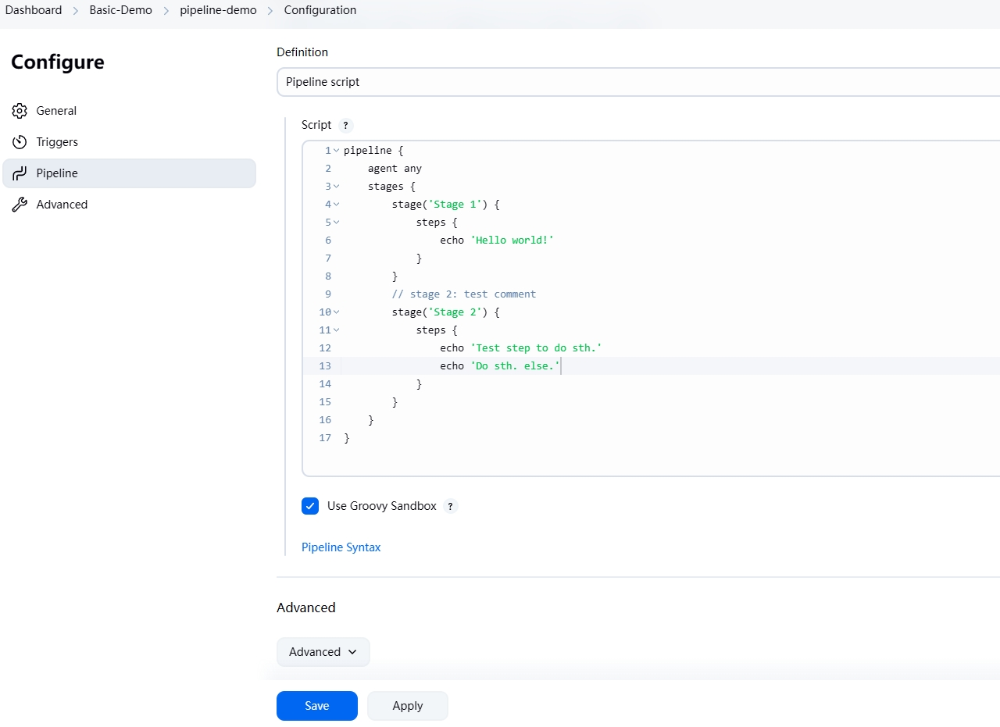

```groovy
pipeline {                                    #1
    agent any                                 #2
    stages {                                  #3
        stage('Stage 1') {                    #4
            steps {                           #5
                sh './scripts/build.sh'       #6
            }
        }
        stage('Stage 2') {
            agent { label 'custom-label' }    #7
            steps {
                echo 'Test step to do sth.'
                echo 'Do sth. else.'
            }
        }
        stage('Stage 3') {
            agent {                           #8
                docker {
                    image 'maven:3-alpine'
                    label 'custom-label'
                    args  '-v /tmp:/tmp'      // 要传递给 docker run 的运行时参数
                } 
            }
            steps {
                sh 'mvn -v'                   #9
            }
            post {                            #10
                echo 'Do sth.'                
            }
        }
    }
	post {                                    #11
        always {
            echo 'Finished execute.'          
        }
	}
}
```

- **#1**：`pipeline { ... }` 块是声明式管道语法的开头，所有有效的声明式语法都包含在此块中
- **#2**：`agent` 用于指定整个流水线或特定阶段（如 **#7**）将在 Jenkins 环境中执行的位置（即执行构建的节点），Jenkins 可以配置多个节点，其可以是物理机、虚拟机或容器。可填内容如下：
  - `agent none`：在顶层声明时，表示不指定 agent，而由每个 Stage 自行指定 agent；若顶层配置此项，Stage 也不指定任何 agent（或 agent none），则会构建失败
  - `agent any`：在任何可用的节点上执行流水线或阶段
  - `agent { label ... }`：如 **#7**，在拥有指定标签的节点上执行流水线或阶段（*Manage Jenkins => Nodes* 选择节点配置即可设置 Label）
  - `agent { node ... customWorkspace ... }`：与 `agent label` 方式效果等价，但可通过 `customWorkspace` 选项来控制节点的工作空间（默认是 `/var/#ROOT_DIR/workspace`，根路径是新增节点时指定）
  - `agent { docker { ... } }`：使用给定的容器执行流水线或阶段（如 **#8**）
    - `docker args` 可填写大多数 `docker run` 时使用的参数，并且会强制抓取镜像（即使镜像已存在）
    - `docker label` 标签效果与 `agent label` 类似，不过这里是用于指定 docker 容器在拥有指定标签的节点运行，不使用则默认是选择任一节点
  - `agent { dockerfile { ... } }`：使用源码仓库包含的 Dockerfile 构建的容器来执行流水线或阶段
  - `agent { kubernetes { ... } }`：与上述所有方式区别在于，执行环境不依赖于 Jenkins 节点，而是在 K8s 集群中动态创建一个 POD 执行构建
- **#3**：`stages` 块用于指定构建的各个阶段，包裹 1~n 个阶段指令，可定义在 pipeline / stage 块中
- **#4**：`stage('name')` 块指定阶段名称，该阶段所有步骤指令也会包裹在其中
- **#5**：`steps` 块指定在所在阶段要执行的 1~n 个步骤，Jenkins 支持的步骤繁多，以下是比较常见的三种：
  - [sh](https://www.jenkins.io/doc/pipeline/steps/workflow-durable-task-step/#sh-shell-script)：指定要执行的 bash 命令（如 **#6**）
  - [build](https://www.jenkins.io/doc/pipeline/steps/pipeline-build-step/)：`build job: 'job_name'`，触发指定名称的 pipeline 执行构建
  - [echo](https://www.jenkins.io/doc/pipeline/steps/workflow-basic-steps/#echo-print-message)：输出文本
  - 其余详见[官文](https://www.jenkins.io/doc/pipeline/steps/)
- **#10/#11**：`post` 定义在流水线或特定阶段的运行完成时执行的 1~n 个附加操作（与 `steps` 相似），post 支持多个后置条件块（如 *always、success、failure、aborted*），比较清晰易懂，其它条件块可看[官文](https://www.jenkins.io/doc/book/pipeline/syntax/#post)

#### 使用 Maven 构建 Java 项目

1. 本节将使用 Jenkins 官方文档提供的学习仓库 [simple-java-maven-app](https://github.com/jenkins-docs/simple-java-maven-app)，读者可自行 fork 玩耍
2. 同样创建一个 Pipeline 项目，在 *Pipeline - Definition* 选择 *Pipeline script from SCM*，然后填写 fork 的仓库地址（如果是自建的 gitlab 等平台还需要填写访问凭证 Credentials）
3. 在 *Script Path* 指定 Jenkinsfile 在仓库中的位置即可 Save 并执行构建

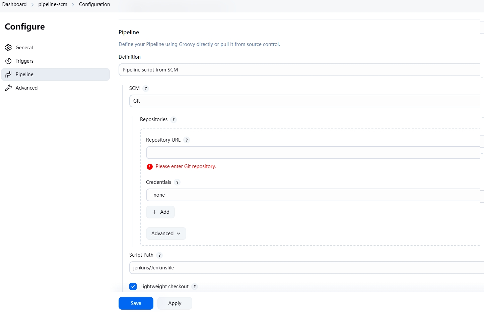

补充：鉴于笔者的 Jenkins 是 Docker 运行，容器内没有 Maven，有两种方式处理：

1. 修改 Jenkinsfile，将 agent 配置修改为 docker 运行一个包含 JDK 和 Maven 的镜像，在此环境中执行构建
2. 在 Jenkins 所在机器安装好 Maven，在 *Manage Jenkins => Tools* 配置 Maven 的路径，然后修改 Jenkinsfile，添加 [tools](#tools) 指令

```groovy
// 由于笔者宿主机有 Maven，因此直接采用第二种：
pipeline {
    agent any

    tools {
        // 这里的名称即为 Manage Jenkins => Tools 中配置的 Maven 名称
        maven 'Maven-3.9.9'
    }
	// ... 其它指令不变
}

// 第一种方式如下：
pipeline {
    agent {
        docker {
            // 选择一个包含 Maven 和 JDK 的镜像
            image 'maven:3.9.9-eclipse-temurin-21-alpine'
            // 可选项，如果你的 Jenkins 是容器运行，
            // 那么此处映射的宿主机其实就是 Jenkins 容器，Maven 是 Jenkins 容器里的容器
            args '-v /opt/maven_repos:/root/.m2'    
        }
    }
    // ... 其它指令不变
}
```

#### 多分支流水线

1. 首先在 fork 的仓库 [simple-java-maven-app](https://github.com/jenkins-docs/simple-java-maven-app) 创建多个分支（比如 dev、prod）
2. 进入 Jenkins GUI *Dashboard => New Item* 界面，选择 *Multibranch Pipeline*，输入名称，点击 OK 创建多分支流水线项目
3. 同样输入仓库地址和 Jenkinsfile 在仓库里的路径

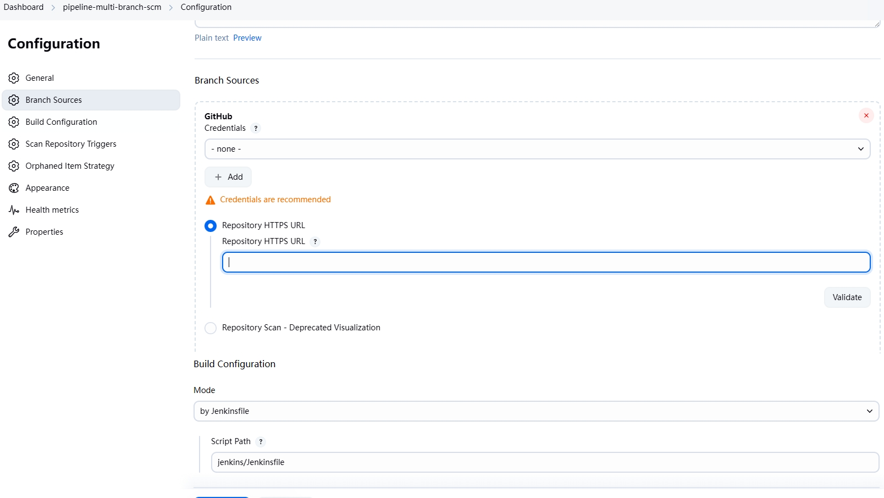

4. 创建项目后，Jenkins 会自动扫描一次仓库，来获取分支信息，至于分支的获取策略，可在这里配置

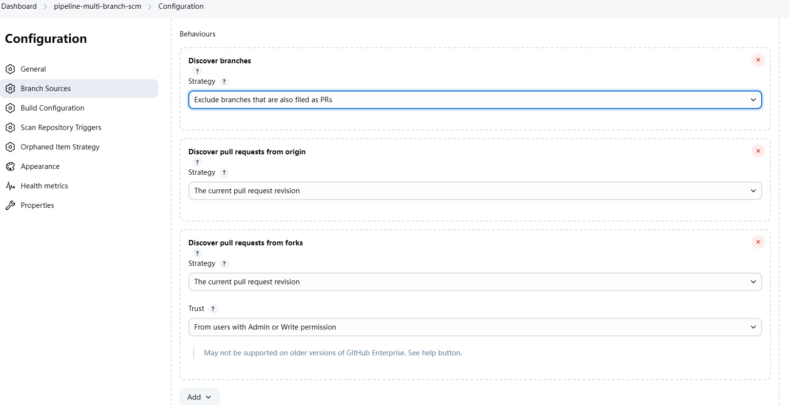

5. 其它配置按默认填写即可，或者可根据需要进行填充，最后点击 Save，这样最基本的多分支流水线项目就创建好了
6. Jenkins 会拉取项目分支并构建一次，以下是创建项目后的界面

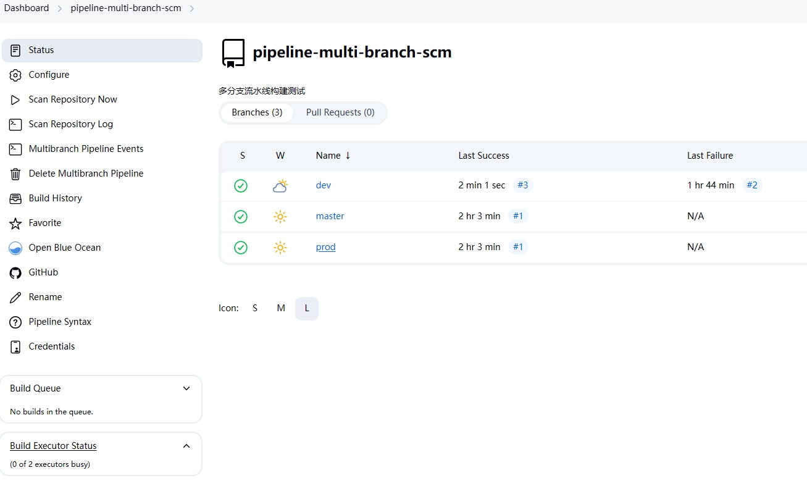

以上述方式创建的项目，每个分支下都有独立的 Jenkinsfile 文件，可以随着分支一起提交并审核，针对环境修改脚本。而如果是项目里的多个分支都基于同一 Jenkinsfile 构建，则可以用 `when` 指令区分，项目里的 Jenkinsfile 修改如下：

```groovy
pipeline {
    
    // ... 省略其它
    
    stages {
       
        // ... 省略其它
        
        // 发布到开发环境
        stage('Deliver for dev') {
            when {
                branch 'dev'               // 当分支为 dev 时执行该阶段
            }
            steps {
                echo 'This is dev env!!!'
            }
        }

        // 发布到测试环境
        stage('Deliver for test') {
            when {
                branch 'test'              // 当分支为 test 时执行该阶段
            }
            steps {
                echo 'This is test env!!!'
            }
        }

        // 发布到生产环境
        stage('Deliver for master') {
            when {
                branch 'master'             // 当分支为 master 时执行该阶段
            }
            steps {
                sh './jenkins/scripts/deliver.sh'
            }
        }
    }
}
```

<a id="when"></a>

**when** 指令指定 Pipeline 根据给定的条件确定是否应该执行该阶段，指令块内必须至少包含一个条件，若有多个条件，则所有条件都为 true 才会执行该阶段。

这里简单列下几种条件，其它详见[官文](https://www.jenkins.io/doc/book/pipeline/syntax/#when)：

- *branch*：只能在多分支流水线项目使用，内容会被当作 *Ant-style path globbing*（模式匹配语法）进行解析，支持两个参数
  - `pattern`：匹配内容，`comparator` 参数未使用时，该参数不用显式指定
  - `comparator`：比较方式，`EQUALS`（相等）、`GLOB`（默认，按 Ant-style 模式匹配）、`REGEXP`（按正则表达式匹配）
- *changelog*：若指定表达式与 Git 提交信息匹配，则执行构建
- *not*：用于指定嵌套条件为 false 时执行构建，必须包含一个子条件，如 `when { not { branch 'dev' } }`
- *allOf*：用于指定嵌套条件都必须为 true 时执行构建，必须包含一个子条件
- *anyOf*：用于指定嵌套条件有一个为 true 时执行构建，必须包含一个子条件

至于分支自动构建，在项目配置中（下图）可以设置定时扫描，或使用对应 SCM 平台的 WebHook 实现推送后自动构建，在传统 freestyle 项目也都有这些配置，就不再赘述。

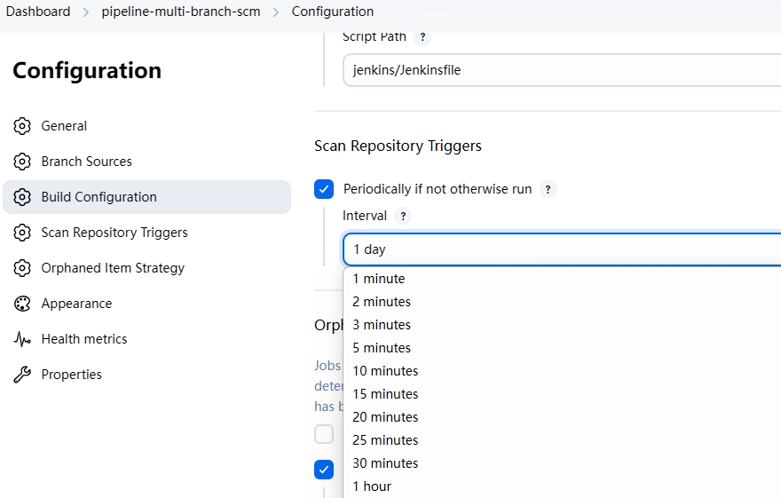

### Jenkinsfile 常用语法

#### environment

用于指定环境变量，可在 `pipeline/stage` 块使用，并能与 *credentials()* 联合，通过凭证 ID 访问凭证。

```groovy
pipeline {
    agent any
    
    environment {
        CC = 'clang'
    }
    
    stages {
        stage('Example credential') {
            environment {
                SERVICE_CREDS = credentials('credential-id')
            }
            steps {
                sh 'echo "cc = $CC"'
                sh "echo cc = ${env.CC}"   						    // 可通过 env 全局变量访问
                sh 'echo "Credential is $SERVICE_CREDS"'            
                sh 'echo "Service user is $SERVICE_CREDS_USR"'      // 获取凭证中的 username
                sh 'echo "Service password is $SERVICE_CREDS_PSW"'  // 获取凭证中的 password
                sh 'printenv'                                       // 打印所有环境变量
                sh 'echo job_name = $JOB_NAME'                      // 环境变量访问方式一
                sh 'echo job_branch = ${BRANCH_NAME}'               // 环境变量访问方式二
            }
        }
    }
}
```

#### parameters

该指令用于指定用户在触发 Pipeline 时应提供的参数列表（即传统 freestyle 项目的 *Build with Parameters*)，这些参数的值可通过 `params` 对象在 Pipeline 步骤中进行访问。

每个参数都包含三个属性：`name、defaultValue、description`，参数类型如下：

- `string`：字符串
- `text`：文本，可包含多行
- `booleanParam`：布尔参数
- `choice`：选择参数
- `password`：密码
  - Jenkins 会将此参数标记为敏感数据，会触发一些安全机制：尝试在构建日志中屏蔽该值、限制该值如何被某些 Pipeline 步骤实例化或使用等
  - [Credentials](https://www.jenkins.io/doc/book/pipeline/jenkinsfile/#handling-credentials)是该参数在功能上的上位替代，关于凭证、敏感数据大多是配置于 Credentials 一起管理，password 比较侧重于 UI 输入时的视觉保密和临时性、半敏感性的信息输入

```groovy
pipeline {
    agent any
    parameters {
        string(name: 'BUILD_ADMIN', defaultValue: 'Mr. Jenkins', description: 'Build User')
        text(name: 'REMARK', defaultValue: '', description: 'Enter some information about the build')
        booleanParam(name: 'TOGGLE', defaultValue: true, description: 'Toggle this value')
        // choice 比较特殊，choices 列表的第一个选项才是默认选择
        choice(name: 'BUILD_ENV', choices: ['DEV', 'TEST', 'PROD'], description: 'Build environment')
        password(name: 'PASSWORD', defaultValue: 'SECRET', description: 'Enter a password')
    }
    stages {
        stage('TEST') {
            steps {
                echo "Hello ${params.BUILD_ADMIN}"
                echo "REMARK: ${params.REMARK}"
                echo "Toggle: ${params.TOGGLE}"
                echo "BUILD_ENV: ${params.BUILD_ENV}"
                echo "PASSWORD: ${params.PASSWORD}"
            }
        }
    }
}
```

用上述脚本创建一个项目后，可以看到左侧出现 *Build With Parameters*，点击即可进行参数设置。

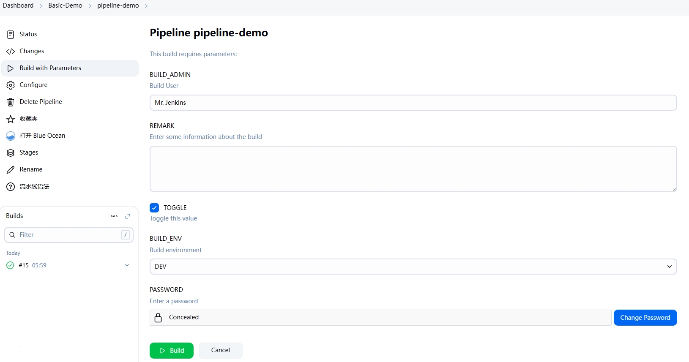

#### options

该指令支持从 Pipeline 本身中配置特定于 Pipeline 的选项，如：

- **disableConcurrentBuilds**：不允许并发执行流水线，可用于防止同时访问共享资源等场景
- **skipStagesAfterUnstable**：一旦构建状态变为 *UNSTABLE*，则后续阶段将不再执行
- **retry**：在失败时, 重新尝试整个流水线的指定次数
- **timeout**：设置流水线运行的超时时间, 在此之后，Jenkins将中止流水线
- 其它详见[官文](https://www.jenkins.io/doc/book/pipeline/syntax/#options)

```groovy
pipeline {
    agent any
    
    options {
        disableConcurrentBuilds()
        skipStagesAfterUnstable()
        timeout(time: 1, unit: 'HOURS')  // 构建超时时间
        retry(3)            			 // 最多尝试构建 1+3 次
    }
    
    stages {
        stage('Test') {
            steps { 
                //...
            }
            options {
                // timeout/retry 也可用在 stage 中使用，针对于所在阶段起作用
                timeout(time: 1, unit: 'MINUTES')
                retry (1)                
            }
        }
        // ... 其它指令
    }
}
```

#### triggers

触发器指令定义重新触发 Pipeline 的自动化方式，可用触发器有：

- **cron**：接受 [cron](https://www.jenkins.io/doc/book/pipeline/syntax/#cron-syntax) 样式字符串以定义应重新触发 Pipeline 的固定间隔，如：`triggers { cron('H */4 * * 1-5') }`
- **pollSCM**：同样接收 cron 样式字符串，在固定间隔中，Jenkins 会检查 SCM 是否有更新，有则会重新触发 Pipeline
- **upstream**：接受以逗号分隔的作业名称和阈值。当任一作业以最小阈值完成时，将重新触发 Pipeline。该方式跟以往 Freestyle 项目的 *Build Triggers => Build after other projects are built* 其实是同个作用，当一个或多个指定的「上游 （upstream）」项目成功构建（或其他指定状态）后，自动触发当前项目的构建，可用场景如下：
  1. 依赖构建：若 B 项目依赖于项目 A 产生的构件（如一个库、一个 API 依赖），当项目 A 成功构建后，项目 B 才应该被构建，那么项目 B 的流水线就可以设置 upstream 为项目 A
  2. 构建流水线拆分：一个非常复杂和耗时的构建/部署流程可能被拆分成多个独立的 Jenkins Pipeline，以提高模块化、可管理性和并行性
  3. 触发不同类型的任务：一个上游项目可能是编译和单元测试，成功后触发一个下游项目进行更耗时的集成测试、性能测试或安全扫描
  4. 扇出构建：这种场景可能比较常见，一个核心库更新后，多个依赖于它的项目都需要重新构建

```groovy
pipeline {
    agent any
    
    triggers {
        cron('H */4 * * 1-5')
        pollSCM('H */4 * * 1-5')
        // 可填阈值：SUCCESS、UNSTABLE、FAILURE，填写 FAILURE 表示构建状态为 SUCCESS、UNSTABLE、FAILURE 时都是符合要求
        upstream(upstreamProjects: 'job_name1,job_name2', threshold: hudson.model.Result.SUCCESS)
    }
    
    // ... 其它指令
}
```

#### tools

用于定义和使用 Jenkins *Manage Jenkins => Tools* 下的工具，主要支持 JDK、Maven、Gradle。

比如在 Tools 中配置了 Maven，则 Jenkinsfile 可以写：

```groovy
pipeline {
    agent any
    tools {
        maven 'custom-maven-name'    // Tools 中定义的 Maven 名称
    }
    stages {
        stage('Example') {
            steps {
                sh 'mvn --version'   // 命令的执行将会使用上方指定的 Maven 环境
            }
        }
    }
    // ... 其它指令
}
```

#### input

该指令在执行构建时与 Jenkins 用户进行交互，当 `steps` 块包含该指令时，会在应用 [options](#options) 指令后，执行 agent / [when](#when) 指令之前暂停当前阶段。

包含以下参数：

- *message*：必填，填写 input 表单时的展示内容
- *id*：可选，input 指令的标识符，默认为 `stage` 名称
- *ok*：可选，input 表单的 *ok* 按钮文本
- *submitter*：可选，指定允许提交 input 的用户或外部组名称，管理员不受影响（Jenkins 权限配置需安装 *Role-based Authorization Strategy* 插件）
- *submitterParameter*：可选，会返回提交 input 的用户 ID
- *parameters*：可选，提示用户需要提供的可选参数列表

```groovy
pipeline {
    agent any
    stages {
        stage('Example') {
            input {
                message "Should we continue?"
                ok "Yes, we should."
                submitter "alice, bob"
                submitterParameter "SUBMITTER_ID"
                parameters {
                    string(name: 'PERSON', defaultValue: 'Mr Jenkins', description: 'Who should I say hello to?')
                }
            }
            steps {
                echo "Hello, ${PERSON} and ${SUBMITTER_ID}"
            }
        }
    }
}
```

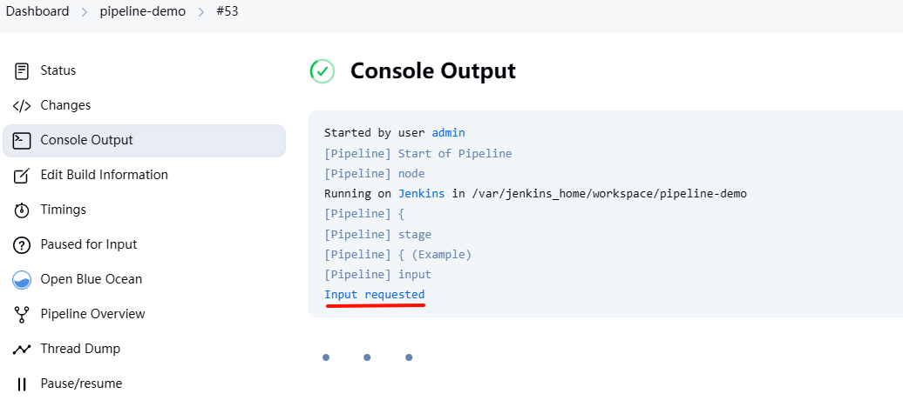

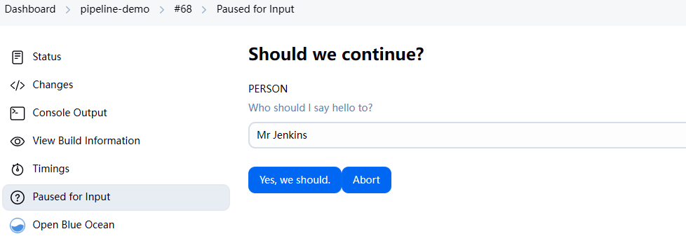

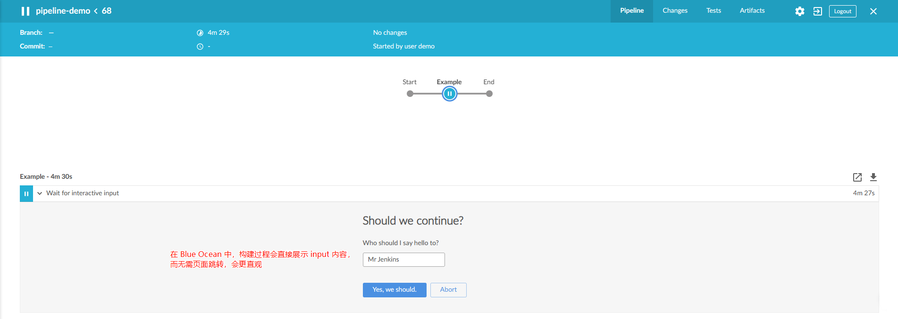

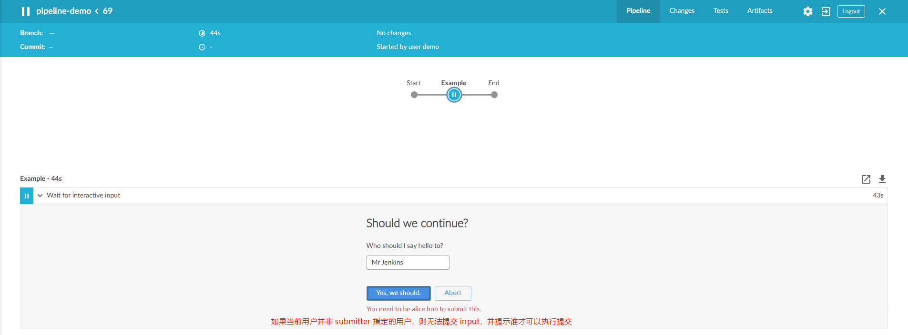

## 分布式构建

### 控制器隔离

Jenkins 服务属于 **Controller/Agent** 架构，服务自带一个**内置节点（built-in node）**用于执行构建操作，开箱即用。这是为了更容易使用 Jenkins，但并不推荐长久使用，因为在内置节点上运行的任何构建都具有与 Jenkins 进程相同的控制器文件系统访问权限级别。

Jenkins **控制器**就是其服务本身，充当决定如何、何时以及在何处运行作业的角色。同时，配置、授权和身份验证等管理任务也在控制器上执行，该控制器为 HTTP 请求提供服务。

而**代理**是负责执行具体作业的服务，它是一个小型 Java 客户端进程，与 Jenkins 控制器建立连接后，由控制器委托作业给其执行。

而在内置节点和代理节点中，都有各自的 **Executor（执行器）**，其本质是一个线程，其数量决定了可以并发运行的任务数量。

为了确保 Jenkins 控制器的稳定性，应在内置节点以外的其它节点上（即代理）执行构建，这在 Jenkins 中称为[**分布式构建**](https://www.jenkins.io/doc/book/scaling/architecting-for-scale/)（distributed builds）。

分布式构建的存在意义是为了解决两种情况：

- **垂直增长**：是指通过配置更多作业或编排更频繁的构建来增加 Jenkins 控制器实例上的负载，这也可能意味着更多的团队依赖于这个控制器（单点风险）；
- **水平增长**：是指创建额外的 Jenkins 控制器（即运行多个 Jenkins 服务）来适应新的团队或项目，而不是向现有控制器添加新的团队或项目（分开但缺乏统一管理）。

在分布式构建环境中，Jenkins 控制器将仅使用其资源来处理 HTTP 请求和管理构建环境。构建的实际执行将委托给代理。使用此配置，可以水平扩展架构，从而允许单个 Jenkins 安装托管大量项目和构建环境。

要防止构建直接在内置节点上运行，可导航至 Jenkis 的 *Manage Jenkins => Nodes*。在列表中选择 *Built-In Node => Configure*。将 executor 数量设置为 0 并保存。同时**应确保已设置了其它构建节点**（或 Cloud）得以执行构建，否则构建将无法执行。或者在配置了多节点后，可使用 [Job Restrictions Plugin](https://plugins.jenkins.io/job-restrictions/) 之类的插件来限制哪些 Job 可以在哪些节点（如内置节点）上运行（这与 Jenkinsfile 中的 `agent { label ... }` 通过标签指定构建节点的表达式无关）。

> [!TIP]
> 在 Jenkins 中，Agent（代理）也可称为 Node（节点），两者等价。

### 配置代理

代理本质是一个 Java 服务，因此需要有 JDK 环境，不过下面以 Docker 为例运行代理，官方镜像已包含了 JDK 环境。

1. 首先在要运行代理的机器上生成密钥：`ssh-keygen -f ~/.ssh/jenkins_agent_key`
2. 在 Jenkins GUI 中创建 Credentials
   - 在 *Manage Jenkins => Credentials* 选择 domains 为 global 的选项新建凭证
   - *Kind* 选择 *SSH Username with private key*，自由填入 *ID*、*Description*、*Username*，*Private Key* 则直接拷贝步骤 1 生成密钥，*Passphrase* 是密码，生成密钥时有填则填，无则忽略，然后创建凭证即可。
3. 运行代理，宿主机端口可自定义：

```bash
docker run -d --rm --name=agent1 -p 22:22 \
-e "JENKINS_AGENT_SSH_PUBKEY=[拷贝步骤 1 生成的公钥]" \
jenkins/ssh-agent:alpine-jdk21
```

4. 在 Jenkins 上设置代理
   - 进入 *Manage Jenkins => Nodes* 新建节点，输入节点名称并选择类型（仅有 *Permanent Agent* 可选）
   - 详细配置信息如下图所示，而图二关于 Agent 启动方式：
     - *Launch agents via SSH*：通过 Jenkins 控制器访问 Agent 所在机器后启动代理服务（即连接步骤 3 启动的容器），然后代理服务再与控制器进行连接
     - *Launch agent by connecting it to the controller*：手动启动 Agent 服务后，直接连接到 Jenkins 控制器，该方式可看[官文](https://www.jenkins.io/doc/book/managing/nodes/#launch-inbound-agent-via-windows-scheduler)

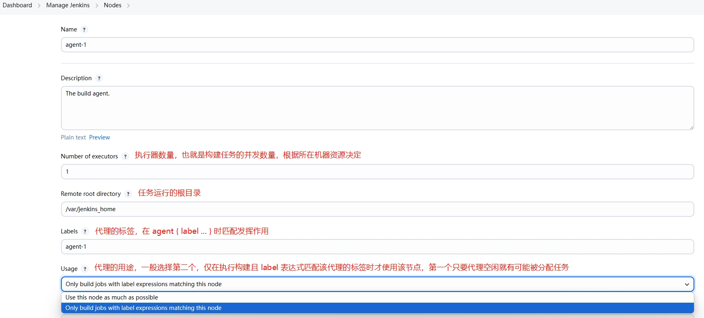

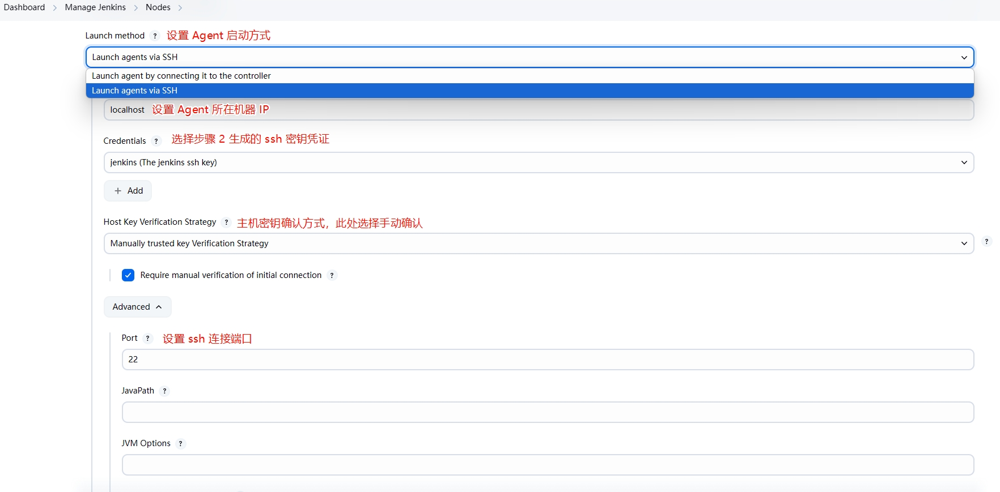

5. 节点新建后，会默认启动一次，但会因为密钥授权问题而失败。选择节点进入管理界面，点击左侧的 *Trust SSH Host Key* 信任密钥（即步骤 4 设置的密钥确认方式），右上角 *Launch agent* 再次启动即可

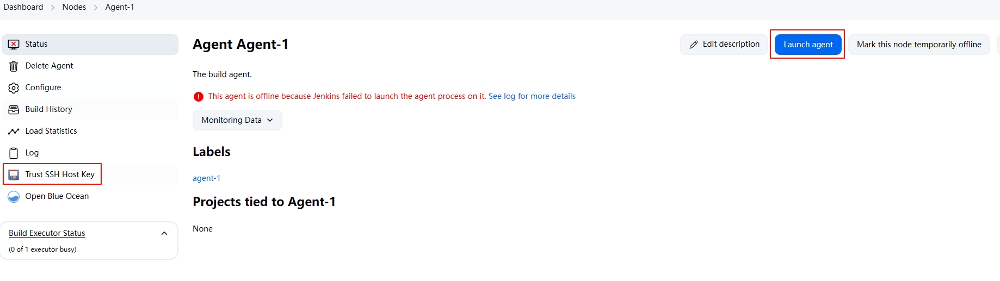

6. 重新构建项目：在流水线项目的 Jenkinsfile 中指定 `agent { label 'agent-1' }` 后，在构建日志即可看到构建操作委托到 Agent 去执行了。

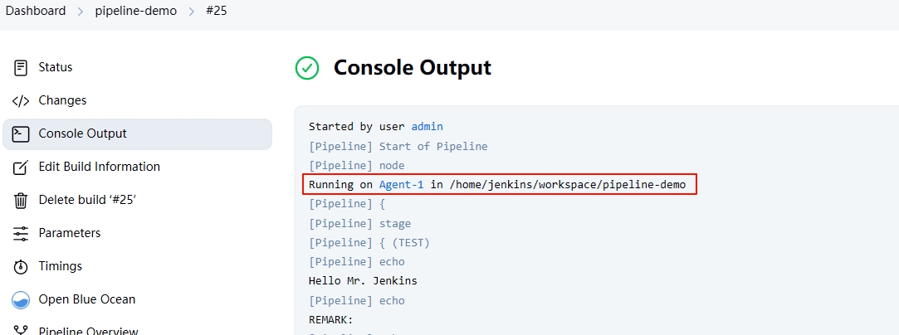

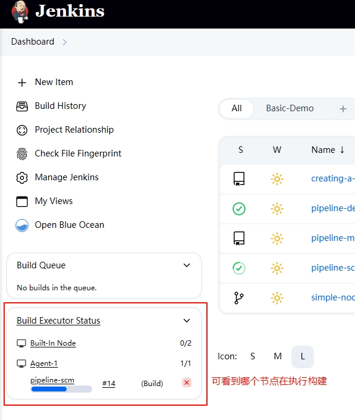

## Jenkinsfile 与代码分离管理

Jenkins Pileline（包括多分支 Pipeline）项目要求将 Jenkinsfile 保存在代码仓库的根目录，这让 Jenkinsfile 分散到了不同项目的各个分支中，对于后期的统一维护和功能扩展增加了成本。为了将 Jenkinsfile 与代码仓库分离，可通过插件 [Pipeline-multibranch-defaults-plugin](https://github.com/jenkinsci/pipeline-multibranch-defaults-plugin) 实现。

1. 安装插件后，进入 *Manage Jenkins => Managed files* 新建配置 *Groovy file*，ID 可自定义，默认是 UUID，然后编写 Jenkinsfile 脚本
2. 新建一个多分支流水线项目，注意本次在 *Build Configuration => Mode* 要选择 *by default Jenkinsfile*，并填入步骤 1 创建的配置文件 ID

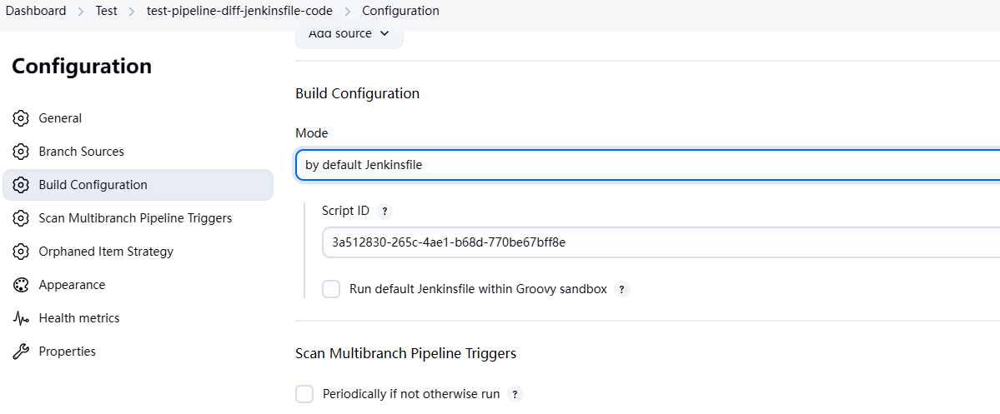

3. 首次执行构建可能会报错（如 `UnapprovedUsageException: script not yet approved for use`），这是因为项目的 Jenkinsfile 若从 SCM 中获取，则默认在 Groovy 沙箱中运行，以防止出现恶意代码。而使用 default Jenkinsfile 则并非如此，因为 Jenkins 认为在配置管理中（由管理员）新增的 Jenkinsfile 会比来源 SCM 的更受信任，并且为了灵活性，避免沙箱环境中操作权限受限，会在非沙箱环境中运行。但是由于 [Script Security Plugin](https://github.com/jenkinsci/script-security-plugin) 插件（默认安装），它会检查脚本中的方法签名是否已存在于批准列表，否则需要管理员手动批准执行脚本。
   - 进入 *Manage Jenkins => In-process Script Approval* 即可看到被拦截的脚本，选择 Approve 批准即可，重新执行构建即可成功
   - 也可以直接在步骤 2 的示例图中勾选 *Run default Jenkinsfile within Groovy sandbox*，表示让默认的 Jenkinsfile 运行在沙箱，那么就无需进行审批

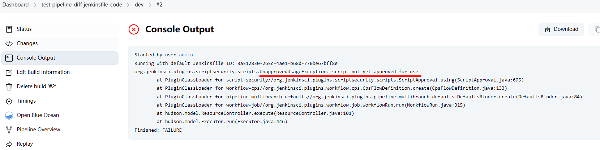

4. 以下是 defualt Jenkinsfile 的示例，但要根据实际情况去调整脚本，无法 1:1 复制使用
   - 做法理解：假设创建多分支流水线项目名为 Demo-Test，然后在管理 Jenkinsfile 的仓库下创建 Demo-Test/dev、Demo-Test/test 等目录，下面放各自分支的 Jenkinsfile，通过拉取 Jenkinsfile 仓库后，以构建的作业名称和分支来加载对应 Jenkinsfile。

```groovy
node {
    
    // 保存当前运行的作业名称
    def currentJobName = ""

    try {
        stage('Checkout Jenkinsfile') {
            
            // 获取当前 Job 名称，并赋值给局部变量，通过 env 访问环境变量
            def jobNameParts = "${env.JOB_NAME}".replace('%2F', '/').split('/')
            // 注意：若流水线项目是建在文件夹下，那么直接取 0 就有问题，因为获取到的会是目录名称，而不是 Job 名称
            currentJobName = jobNameParts[0]
            echo "Determined job name part for loading: ${currentJobName}"

            // 2. clone Jenkinsfile 仓库
            git url: 'https://github.com/xxx.git',   // 填写 Jenkinsfile 仓库地址，可以是 HTTP 或 SSH
                branch: 'main',                      // 指定拉取的分支，默认是 master
                credentialsId: 'jenkins'             // 指定访问 SCM 的凭证，在 Jenkins 中配置后填写凭证 ID
            echo "Checkout complete."
        }

        stage('Load Dynamic Jenkinsfile') {
            // 根据 Job 名称及构建分支获取对应 Jenkinsfile
            def check_groovy_file = "${currentJobName}/${env.BRANCH_NAME}/Jenkinsfile"
            // load 指令用于加载 Jenkinsfile
            load check_groovy_file
        }

    } catch (Exception e) {
        // 当出现异常时，打印错误信息，并将构建结果设置为 FAILURE
        echo "Pipeline failed: ${e.getMessage()}"
        currentBuild.result = 'FAILURE'
        throw e       // 重新抛出异常，使 Pipeline 失败
    } finally {
        stage('Cleanup') {
            echo "Performing cleanup tasks..."
            cleanWs() // 可选：清理工作空间
        }
    }
}
```

> [!NOTE]
> default Jenkinsfile 之所以使用脚本式管道语法，是因为声明式管道语法规定有且仅有一个 pipeline 块，使其无法 load 同样包含 pipeline 块的 Jenkinsfile。而脚本式语法没有此类限制，能容纳此类设计为独立运行的 Jenkinsfile，故常用于编排。当然，你也可以在被 load 的文件仅编写 stages/steps 等指令从而实现构建。
>
> 如果 default jenkinsfile 指定了运行的 Agent，那么要注意 load 加载的 Jenkinsfile 是否与 default Jenkinsfile 在同一个 Agent 上运行。若是，并且该 Agent 只配置了一个 Executor，那么就会造成死锁的情况，因为对于 Jenkins 来说，这是两个任务。

## 总结

Jenkins Pipeline 不难理解，在明白了概念和语法后，就可以上手实操。Pipeline 也是让构建流程更加结构化，并且能像代码一样审计、迭代。对于实际项目的 CI/CD，其实在构建过程会更多的依赖 bash 脚本等的操作，如代码镜像构建、推送、K8S 部署、通知等等，有什么构建需求，就翻翻官网文档，看看提供的操作即可。
