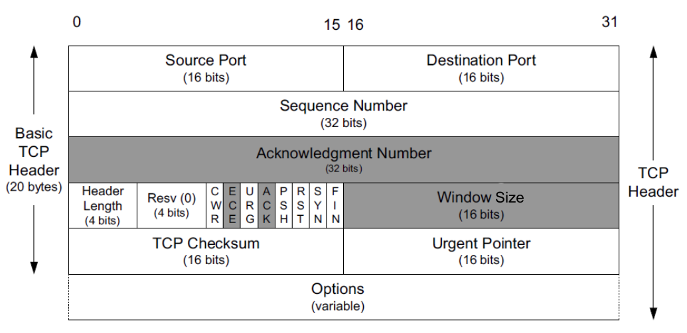
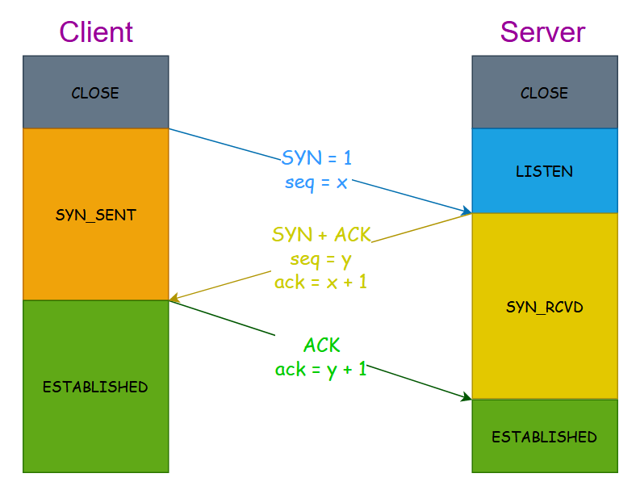
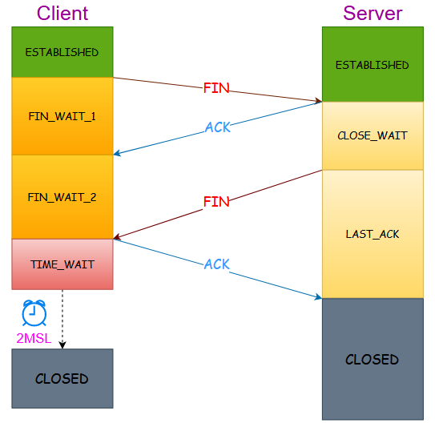
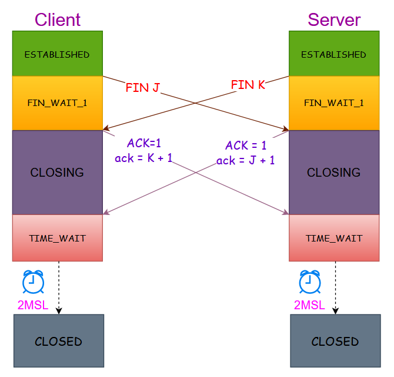
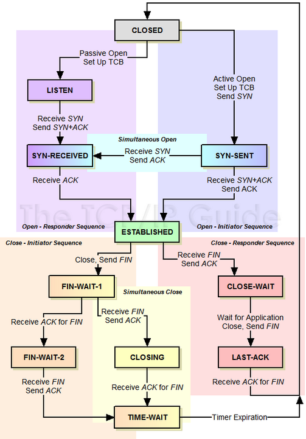
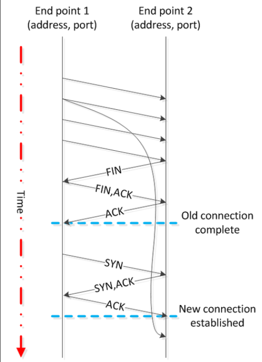
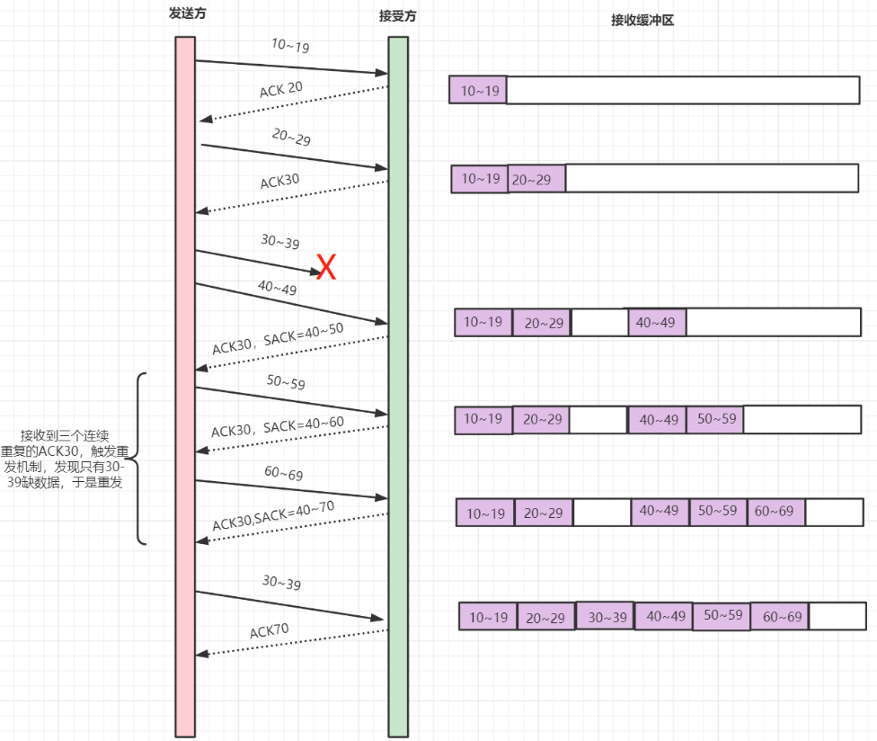
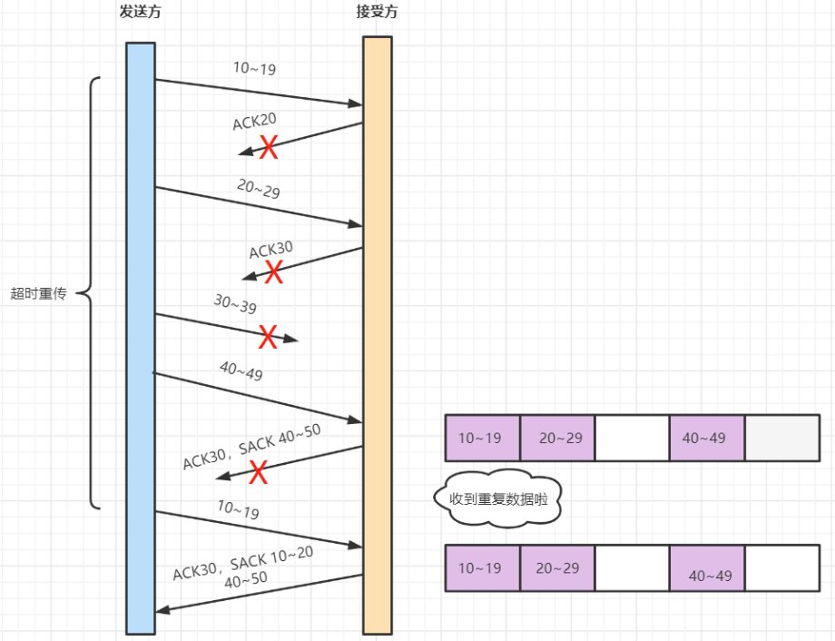

> [!NOTE]
> 本篇是关于 TCP 的知识点记录，会比较琐碎。

## 基础认识

**TCP（Transmission Control Protocol）**：传输控制协议是一种面向连接的、可靠的、基于字节流的传输层通信协议；是为了在不可靠的互联网络上提供可靠的端到端字节流而专门设计的一个传输协议；TCP 位于网络 OSI 七层模型中的第四层 Transport（传输）层。

一个 TCP 连接需要四元组来表示同一个连接，即源 IP（`src_ip`）、源端口（`src_port`）、目标 IP（`dst_ip`）、目标端口（`dst_port`）；但其实还有一个协议，即五元组，而若仅考虑 TCP，则是四元组。

关键参数：
- `Sequence Number`：seq 序号，32 位，用来标识从 TCP 源端向目的端发送的字节流，发起方发送数据时对此进行标记，用于解决网络包乱序（reordering）问题
- `Acknowledgement Number`：`ack` 确认序号，32 位，当 `ACK` 标志位为 1 时确认序号才有效（`ack = seq + 1`），可用于解决丢包的问题，同时也表达了接收端希望接收的下一个数据包的起始 `seq` 序号
- `Window`：又称 `Advertised-Window`，即滑动窗口（Sliding Window），用于解决流控
- `TCP Flag`：数据包（报文段）的类型，用于操控 [TCP 有限状态机](#有限状态机)，关键标志位如下：
    - `URG`：紧急指针（urgent pointer），置为 1 表示启用了优先数据传输功能，数据不会存入缓冲区，而是直接发送给目标应用程序（即使缓冲区有数据）
    - `ACK`：确认序号有效（注意与确认序号 `ack` 的区别，仅当标志位的 `ACK=1` 时，确认序号 `ack` 才有效，连接建立后所有报文都需要将该标志位 `ACK` 置 1）
    - `PSH`：表示消息应当立即被「推送」，当标志位置为 1 时，`PSH` 报文段会放在缓冲区的末尾，然后立马将数据交付给目标应用程序，而无需等到缓冲区填满，使用场景：telnet、FTP（文件传输）
    - `RST`：重建连接
    - `SYN`：发起一个新连接
    - `FIN`：释放一个连接

> [!NOTE]
> 下文标志位全部大写表示，非标志位则小写表示

在网络当中的通信模式有以下两种：

- **单工**（Simplex）：指数据传输只支持数据在一个方向上传输（HTTP 1.1）
- **双工**（Duplex）：指二台通讯设备之间，允许有双向的数据传输，即发送和接收皆可，可细分为：
  - **半双工**（Half-Duplex）：允许二台设备之间的双向数据传输，但不能同时进行
  - **全双工**（Full-Duplex）：允许二台设备间同时进行双向数据传输（HTTP 2.0、TCP、WebSocket）

## 三次握手

**概念**：三次握手（Three-Way-Handshake）即建立 TCP 连接，一个 TCP 连接的创建需要客户端和服务端总共发送 3 个包才能完成。

1.  第一次握手：Client 将标志位 `SYN` 置为 1，随机产生一个值 `seq=x`，并将该数据包发送给 Server，Client 进入 `SYN_SENT` 状态，等待 Server 确认
2.  第二次握手：Server 收到数据包后由标志位 `SYN=1` 知道 Client 请求建立连接，Server 将标志位 `SYN` 和 `ACK` 都置为 1，`ack=x+1`，随机产生一个值 `seq=y`，并将该数据包发送给 Client 以确认连接请求，Server 进入 `SYN_RCVD` 状态
3.  第三次握手：
    - Client 收到确认后，检查 `ack` 是否为 x+1，`ACK` 是否为 1，如果正确则将标志位 `ACK` 置为 1，`ack=y+1`，并将该数据包发送给 Server，然后将状态修改为 `ESTABLISHED`
    - Server 收到数据包后检查 `ack` 是否为 y+1，`ACK` 是否为 1，如果正确则连接建立成功，Server 进入 `ESTABLISHED` 状态，完成三次握手，随后 Client 与 Server 即可开始传输数据

**三次握手的目的**：主要是为了初始化 `seq` 的初始值，通信双方需要互相通知对方自己初始化的 `seq`（即 `ISN - Inital Sequence Number`），所以叫 `SYN - Synchronize Sequence Numbers`（注意：这里的 SYN 不是指标志位的 `SYN`，而是字面意思的同步序号），即握手流程中的序号 x 和 y，这两个序号会作为以后数据通信的序号，以保证应用层接收到的数据不会因为网络上的传输的问题而乱序（TCP 会用这个序号来拼接数据）。

### 半连接与全连接

**半连接队列**（SYN queue）：在三次握手过程中，Server 发送 `SYN - ACK` 之后，收到 Client 的 `ACK` 之前的 TCP 连接称为**半连接（half-open connect）**，此时 Server 处于 `SYN_RCVD` 状态，这些连接会存放在半连接队列中。

**全连接队列**（accepet queue）：第三次握手中 Server 收到 Client 的 `ACK` 后，内核会把连接从 SYN queue（半连接队列）移除，然后创建新的**全连接**，并添加到 accept queue（全连接队列），等待进程调用 accept 函数时把连接取出来。

**SYN 攻击**：攻击者短时间伪造不同 IP 地址的 `SYN` 报文，服务端每接收到一个 `SYN` 报文，就进入 `SYN_RCVD` 状态，但服务端发送出去的 `ACK + SYN` 报文，无法得到未知 IP 主机的 `ACK` 应答，久而久之就会占满服务端的半连接队列，使得服务器不能为正常用户服务。

关于 **SYN 攻击防御**可以看看 [SYN 攻击与避免方式](https://www.xiaolincoding.com/network/3_tcp/tcp_interview.html#%E4%BB%80%E4%B9%88%E6%98%AF-syn-%E6%94%BB%E5%87%BB-%E5%A6%82%E4%BD%95%E9%81%BF%E5%85%8D-syn-%E6%94%BB%E5%87%BB)，关键参数是 `tcp_syncookies`，本意是当 SYN queue 满后 TCP 会通过 `src_port、dest_port` 和时间戳构建一个特殊的 `seq`（又叫 `cookie`）返回给 Client（第二次握手时），若是攻击者则不会有响应，若是正常连接则会携带该 `cookie`，Server 只要验证该 `cookie` 即可建立连接（即使该连接不存在于 SYN queue）。

## 四次挥手

**概念**：四次挥手（Four-Way Wavehand）即终止 TCP 连接，就是指断开一个 TCP 连接时，需要客户端和服务端总共发送 4 个包以确认连接的断开。

### 一方主动关闭，另一方被动关闭过程

1.  第一次挥手：Client 发送一个 `FIN`，用来关闭 Client 到 Server 的数据传送，Client 进入 `FIN_WAIT_1` 状态
2.  第二次挥手：Server 收到 `FIN` 后，发送一个 `ACK` 给 Client，确认序号 `ack` 为收到的 `seq+1`（与 `SYN` 相同，一个 `FIN` 占用一个序号），Server 进入 `CLOSE_WAIT` 状态，Client 收到 `ack` 后进入 `FIN_WAIT_2` 状态
3.  第三次挥手：Server 发送一个 `FIN`，用来关闭 Server 到 Client 的数据传送，Server 进入 `LAST_ACK` 状态
4.  第四次挥手：Client 收到 `FIN` 后，Client 进入 `TIME_WAIT` 状态，接着发送一个 `ACK` 给 Server，确认序号为收到的 `seq+1`，Server 进入 `CLOSED` 状态，完成四次挥手

### 双方同时发起关闭过程

1. 第一次挥手：Client 与 Server 同时向对方发送 `FIN`，并进入 `FIN_WAIT_1` 状态，双方收到 `FIN` 后转为 `CLOSING` 状态
2. 第二次挥手：Client 与 Server 互相向对方发送 `ACK`，双方收到后进入 `TIME_WAIT` 状态

从双方同时发起关闭操作的角度看，关闭连接就只有两次挥手，因为 TCP 是全双工协议，而且 Client 与 Server 两端都需要 `FIN` 和 `ACK`，只不过有一方是被动的，所以看起来就是四次挥手，若两边同时断开连接，那就都会进入 `CLOSING` 状态，进而变成 `TIME_WAIT` 状态。

## 有限状态机

在 TCP 协议下，有限状态机（**_Finite State Machine_**）用于描述连接的「**生命阶段（Life Stages）**」。一个 TCP 设备与另一个 TCP 设备之间的每个连接都以没有连接的空（null）状态开始，然后经过一系列状态，直到建立连接。接着它保持在该（连接）状态，直到发生某些事情导致连接再次关闭，此时它继续通过另一系列过渡状态并返回到关闭状态。

### 相关概念

以下三个缩写用于控制状态之间转换的三种类型的消息，对应于设置的 TCP 头标志位，以表示消息正在服务该功能：
- `SYN`：同步消息，用于启动和建立连接，如此命名是因为它的功能之一是在设备之间同步序列号（`seq`）
- `FIN`：完成消息，它是一个设置了 `FIN` 位的 TCP 段（Segment），表示设备要终止连接
- `ACK`：确认消息，表示收到一条消息，例如一个 `SYN` 或一个 `FIN`

`TCB（Transfer control block）`：传输控制块，用于存储有关连接的重要信息，如两个套接字号和指向发送-接收缓存区的指针，TCB 也用于实现滑动窗口机制，其保存跟踪接收和确认的字节数、接收和尚未确认的字节数、当前窗口大小等的变量，每个 TCP 连接都有自己的 TCB。

- `Active OPEN`：主动/活动 OPEN，使用 TCP 的客户端进程即为主动方，并通过实际发送 TCP 消息来启动连接（SYN 消息）
- `Passive OPEN`：被动 OPEN，表示服务端进程正在侦听，等待客户端通过指定端口与其建立连接
- 创建时机：建立 TCP 连接的过程开始之前，每一端的设备必须执行一些「准备工作」，其中之一就是创建 TCB，是在连接建立过程的一开始就完成，即设备刚刚转换出 `CLOSED` 状态时
- 销毁时机：连接完全终止并且设备转回 `CLOSED` 状态时销毁
- TCB 与连接关联方式：
	- Client 已知其访问的客户端与服务端进程的 IP 与 Port，因此可使用这些唯一标识来定位关联的 TCB
	- Server 实际是处于监听状态，并不清楚哪个 Client 会来连接，并且几乎可同时被多个 Client 连接，所以 Server 会创建一个带有未指定（0）的 Client 套接字号的 TCB，并等待接收到（主动）OPEN，然后将 Client 套接字号绑定到 TCB 以作为连接过程的一部分以进行被动 OPEN，为了允许处理多个传入连接，Server 进程实际上可能同时执行几个未指定的被动 OPEN
	- 套接字号（Socket Number）：IPv4 地址和端口号的组合称为套接字号，一个套接字号可以在整个互联网中唯一标识一个网络资源

### 状态图与状态表

 状态 | 状态描述 | 事件与过渡 
:------------: | :------------ | :------------ 
`CLOSED` | 每个连接在建立过程开始之前开始的默认状态，在标准中也称为「虚构（fictional）」，因为该状态表示设备之间没有连接，要么尚未创建，要么刚刚被销毁 | **Passive OPEN**：服务器通过在 TCP 端口上进行被动打开来开始连接设置过程。同时，它建立了管理连接所需的数据结构（[传输控制块或TCB](http://www.tcpipguide.com/free/t_TCPConnectionPreparationTransmissionControlBlocksT.htm)），然后它转换到 `LISTEN` 状态 **Active OPEN，发送 SYN**：客户端通过发送 `SYN` 消息开始连接建立，并为此连接建立 TCB。然后它转换到 `SYN-SENT` 状态 
`LISTEN` | 设备（通常是服务器）正在等待接收来自客户端的同步（`SYN`）消息，它还没有发送自己的 `SYN` 消息 | **接收客户端 SYN，发送 SYN+ACK**：服务器设备接收来自客户端的 `SYN`，它发回一条包含自己的 `SYN` 的消息，并确认它收到的消息（`ACK`），服务器进入 `SYN-RECEIVED` 状态 
`SYN-SENT` | 客户端已发送同步（SYN）消息，并正在等待来自其他设备（通常是服务器）的匹配 `SYN` | **接收 SYN，发送 ACK**：如果发送了 `SYN` 消息的设备从其他设备接收到 `SYN`，但没有收到自己 `SYN` 的 `ACK`，它会确认收到的 `SYN`，然后转换到 `SYN-RECEIVED` 以等待确认它的 `SYN` **接收 SYN+ACK，发送 ACK**：如果发送 `SYN` 的设备同时收到对其 `SYN` 的确认以及来自其他设备的 `SYN`，它会确认收到的 `SYN`，然后直接进入 `ESTABLISHED` 状态 
`SYN-RECEIVED` | 设备既收到了来自其伙伴的 `SYN`（连接请求），又发送了自己的 `SYN`，它现在正在等待对其 `SYN` 的 `ACK` 以完成连接设置 | **接收 ACK**：当设备接收到它发送的 `SYN` 的 `ACK` 时，它会转换到 `ESTABLISHED` 状态 
`ESTABLISHED` | 打开的 TCP 连接的「稳定状态（steady state）」，一旦连接中的两个设备都进入此状态，就可以自由交换数据，这将一直持续到连接因某种原因关闭 | **关闭、发送 FIN**：设备可以通过发送带有 `FIN`（完成）位的消息来关闭连接，并转换到 `FIN-WAIT-1` 状态 **接收 FIN**：设备可能会收到来自其连接设备的 `FIN` 消息，要求关闭连接，它将确认此消息并转换到 `CLOSE-WAIT` 状态 
`CLOSE-WAIT` | 设备已收到来自其他设备的关闭请求（`FIN`），现在必须等待本地设备上的应用程序确认此请求并生成匹配请求 | **关闭、发送 FIN**：使用 TCP 的应用程序在被告知其他进程想要关闭后，向正在运行它的机器上的 TCP 层发送关闭请求，然后 TCP 向已经要求终止连接的远程设备发送一个 `FIN`，然后转换到 `LAST-ACK` 
`LAST-ACK` | 已收到关闭请求并确认的设备已发送自己的 `FIN` 并正在等待此请求的 `ACK` | **为 FIN 接收 ACK**：设备收到其关闭请求（`FIN`）的确认，并收到了另一个设备的 `FIN` 并确认了它，进入 `CLOSED` 状态 
`FIN-WAIT-1` | 处于此状态的设备正在等待其发送的 `FIN` 的 `ACK`，或者正在等待来自其他设备的连接终止请求 | **为 FIN 接收 ACK**：设备收到其关闭请求（`FIN`）的确认，转换到 `FIN-WAIT-2` 状态 **接收 FIN，发送 ACK**：设备不接收自己 `FIN` 的 `ACK`，而是接收来自其他设备的 `FIN`，它确认该 `FIN`，并进入 `CLOSING` 状态 
`FIN-WAIT-2` | 处于此状态的设备已收到终止连接请求的 `ACK`，现在正在等待来自其它设备的匹配 `FIN` | **接收 FIN、发送 ACK**：设备从其它设备接收 `FIN`，确认后进入 `TIME-WAIT` 状态 
`CLOSING` | 该设备已收到来自其他设备的 `FIN` 并为其发送了 `ACK`，但尚未收到自己的 `FIN` 消息的 `ACK` | **为 FIN 接收 ACK**：设备收到其关闭请求（`FIN`）的确认，转换到 `TIME-WAIT` 状态 
`TIME-WAIT` | 该设备现在已经从另一个设备接收到一个 `FIN` 并对其进行确认，并发送了自己的 `FIN` 并收到了一个 `ACK`，除了等待确保收到 `ACK` 并防止与新连接的潜在重叠（关于该状态的详细请参阅 [TCP 连接终止](http://www.tcpipguide.com/free/t_TCPConnectionTermination.htm)） | **Timer Expiration**：在指定的等待期（**2MSL**）后，设备转换到 `CLOSED` 状态 

### TIME-WAIT 状态说明

相关概念：
- `MSL（Maximum Segment Lifetime）`：是构成 TCP 协议一部分的数据报的任何段在被丢弃之前在网络上保持有效的最大时间，默认是 2 分钟，此时间限制最终受用于传输 TCP 段的 IP 数据报中的 TTL 字段的限制
- `MTU（Maximum Transmission Unit）`：最大传输单元，一个网络包（帧）的最大长度，即发送方能接收的有效负载，以太网中一般为 1500 字节，超过的话在进入到路由器时会被拒绝转发
- `MSS（Maximum Segment Size）`：最大报文长度，除去 IP 和 TCP 头部之后，一个网络包所能容纳的 TCP 数据的最大长度，若 HTTP 请求数据过长，超过 MSS 长度，则 TCP 会把数据拆成多个的数据包发送，而不是一次性发送所有数据，也就是拆包
- `TCP.SO_REUSEADDR`：该参数用于设置当一个端口处于 `TIME_WAIT` 状态时，不用等待时间结束就可以直接进入使用模式

#### 该状态存在的问题

`TIME-WAIT` 状态的持续时间为 $2*MSL$，也就是默认 4 分钟，TCP 连接中的一个套接字被干净地关闭将保持 `TIME_WAIT` 状态大约 4 分钟。如果许多连接被快速打开和关闭，则 `TIME_WAIT` 中的套接字可能会开始在系统上累积，若累积过多，会导致本地可用端口缺失而无法建立新连接。

#### 该状态存在的原因

1. 防止来自一个连接的延迟段被误解为后续连接的一部分，当连接处于 $2*MSL$​ 等待状态时到达的任何段都将被丢弃
   - 在上图中，有两个从端点 1 到端点 2 的连接，每个端点的地址和端口在每个连接中都是相同的，第一个连接以端点 2 发起的主动关闭而终止，如果端点 2 没有在 `TIME_WAIT` 中保持足够长的时间以确保来自先前连接的所有段都已失效，那么延迟段（具有适当的序列号）可能被误认为是第二个连接的一部分
   - 延迟的段不太可能导致这样的问题。首先，每个终点的地址和端口都必须相同，这通常不太可能，因为客户端的端口通常是由操作系统从临时端口范围中选择，因此在连接之间会发生变化。其次，延迟段的序列编号（seq）需要在新连接中有效，这也不太可能。但是，如果这两种事情都发生了，那么 `TIME_WAIT` 将阻止新连接的数据损坏

2. 可靠地实现 TCP 的全双工连接终止：假设客户端先发起 `FIN`，那么在服务端发送 `FIN` 后，没有收到 `ACK`，就会导致服务端重发 `FIN`，若没有 `TIME-WAIT`，让连接直接进入 `CLOSED` 状态，那么会导致服务端收到的响应是 `RST`，这将导致服务端发生错误，即使数据正确传输

## 重传机制

### 超时重传

**超时重传**指经过 RTO 时间后未收到接收方的 ACK 便重传数据报文。

- `RTT（Round Trip Time）`：即一个数据包从发出去到回来的时间。
- `RTO（Retransmission TimeOut）`：超过 RTO 设置的时间没有收到 ack，数据包就会重发，通过 RTT 来控制 RTO 时间。

存在的问题：
1. 基于时间维度，当一个报文段丢失时，需要等待一定的超时周期后才会重传，增加了端到端的时延
2. 当一个报文段丢失时，在其等待超时的过程中，在其之后的报文段已经被接收端接收但却迟迟得不到 ACK，发送端会认为也丢失了，从而引起不必要的重传，既浪费资源也浪费时间

### 快速重传

**快速重传**机制不以时间驱动，而是以数据驱动，基于接收端的反馈信息（`ACK`）来引发重传。

假设发送 6 个报文，`seq` 分别是 1~6，其中只有 `seq=3` 未收到 `ACK`，那么接收方后续收到 `seq=4/5/6` 时，`ACK` 也会是 3，发送方便可得知 `seq=3` 的报文需要重传。

存在的问题：`ACK` 只向发送端告知最大的有序报文段，但具体丢失的报文段是哪个并不清楚，比如上述例子，可能丢失的是 `seq=3`，也可能是 `seq=4/5/6` 都丢失了

### SACK

**SACK**（Selective ACK）是带选择确认的重传，在快速重传的基础上，接收端返回最近收到的报文段的序列号范围，发送端便知道该重传哪些报文段。

### D-SACK

**D-SACK**（Duplicate SACK）在 SACK 的基础上作扩展，用于告诉发送方，接受方自己哪些数据重复接收了。

## 滑动窗口 & 拥塞控制

`滑动窗口（Sliding Window）`：TCP 头里有个字段叫 `Window`（`Advertised-Window`），这个字段是接收端告诉发送端自己还有多少缓冲区可以接收数据，于是发送端就可以根据这个接收端的处理能力来发送数据，而不会导致接收端处理不过来，也就是流控。

`拥塞处理（Congestion Handling）`：就是在网络中发生拥塞时，减少向网络中发送数据的速度，防止造成恶性循环；同时在网络空闲时，提高发送数据的速度，最大限度地利用网络资源。

`网络拥塞`：网络中的数据太多，导致某个路由器处理不过来或处理的太慢。路由器的内存是有限的，若同一时间到达某个路由器的数据太多，这个路由器将无法接收所有的数据，只能将一部分丢弃；或者同一台路由器数据太多，后面到达的数据将要等待较长的时间才会被转发。

拥塞控制的四个算法：
1. 慢启动
2. 拥塞避免
3. 拥塞发生
4. 快速恢复

## 参考资料

1. [知乎 - TCP 分段 & IP 分片](https://zhuanlan.zhihu.com/p/504695779)
2. [小林coding - TCP 半连接队列和全连接（包含监控与修改方式）](https://www.xiaolincoding.com/network/3_tcp/tcp_queue.html)
3. [TCP / IP 向导](http://www.tcpipguide.com/index.htm)
4. [TCP 推送功能描述](http://www.tcpipguide.com/free/t_TCPImmediateDataTransferPushFunction.htm)
5. [TCP 优先传输数据功能描述](http://www.tcpipguide.com/free/t_TCPPriorityDataTransferUrgentFunction-2.htm)
6. [TCP 连接建立 - 三次握手描述](http://www.tcpipguide.com/free/t_TCPConnectionEstablishmentProcessTheThreeWayHandsh-3.htm)
7. [TCP 连接建立序列号（seq）同步和参数交换以及问题分析](http://www.tcpipguide.com/free/t_TCPConnectionEstablishmentSequenceNumberSynchroniz.htm)
8. [TCP 连接关闭描述](http://www.tcpipguide.com/free/t_TCPConnectionTermination-2.htm)
9. [TCP 消息段格式（结构）](http://www.tcpipguide.com/free/t_TCPMessageSegmentFormat-3.htm)
10. [TCP 有限状态机（FSM）](http://www.tcpipguide.com/free/t_TCPOperationalOverviewandtheTCPFiniteStateMachineF-2.htm)
11. [TIME-WAIT 和它的设计对协议和可扩展服务器的影响](http://www.serverframework.com/asynchronousevents/2011/01/time-wait-and-its-design-implications-for-protocols-and-scalable-servers.html)
12. [陈皓 - 从一次经历谈 TIME_WAIT 的那些事](https://coolshell.cn/articles/22263.html)
13. [在繁忙的 Linux 服务器上处理 TCP TIME-WAIT 状态](https://vincent.bernat.ch/en/blog/2014-tcp-time-wait-state-linux)
14. [OmniSecu](https://www.omnisecu.com/tcpip/what-are-port-and-socket-numbers.php#:~:text=The%20combination%20of%20an%20IPv4%20address%20and%20a,identify%20a%20network%20resource%20in%20the%20whole%20internet.)（同样是网络协议的科普网站）
15. [52IM - 深入理解TCP协议（下）：RTT、滑动窗口、拥塞处理](http://www.52im.net/thread-515-1-1.html)
16. [计算机网络——TCP的拥塞控制（超详细）](https://www.cnblogs.com/tuyang1129/p/12439862.html)
