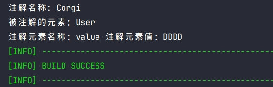
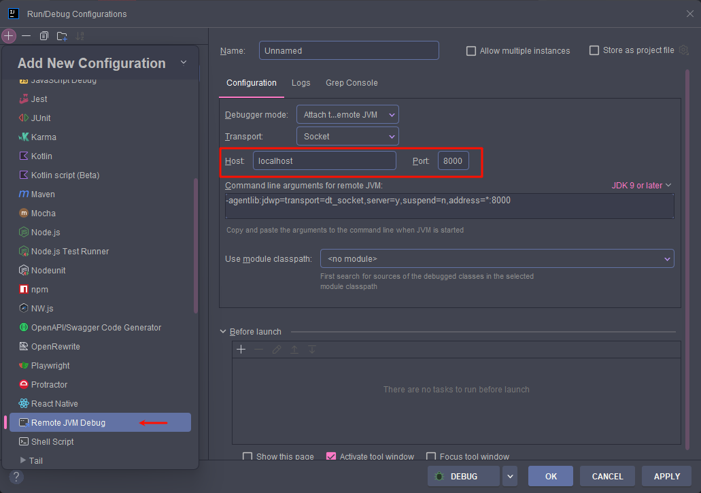
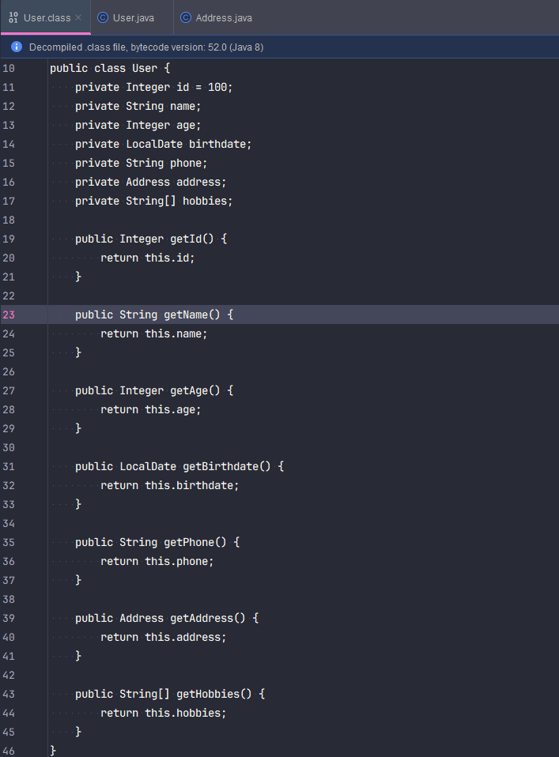

## 介绍   

Java 1.5 新增了一种 Java 语言机制「**注解**」，允许使用注解类型来注解类、字段和方法。这些注解通常由构建时工具或运行时库处理，以实现新的语义效果。为了支持**构建时自定义注解处理**，[JSR-269](https://jcp.org/en/jsr/detail?id=269) 定义了 API，允许使用标准的可插拔 API（Pluggable Annotations Processing API）创建注解处理器，允许在编译阶段自定义对指定注解的处理。该 API 简化了注解处理器的创建，并允许自动发现给定源文件对应的注解处理器。

而这也是每位 Javaer 熟悉的工具 Lombok 实现的核心依赖，通过注解处理器 + Java 编译器模块的内部 API 从而实现以注解方式生成类的模板代码。

本篇将讲解注解处理器的使用，并实现一个简易的 **Lombok @Getter** 注解功能的效果。

## 注解处理器基础使用   
1. 创建一个自定义注解处理器类，需要继承 `AbstractProcessor`，该抽象类要重点关注的方法有：   
    - `process()`：处理当前注解处理器关注的注解，由于注解处理器会有多个，返回值 true 表示不要求后续处理器处理该注解，false 则相反   
    - `init()`：执行初始化操作的方法，可通过此方法创建所需的类型，一般调用内部编译器 API 的实例在此创建   
    - `getSupportedSourceVersion()`：当前注解处理器支持的 JDK 版本   
    - `getSupportedAnnotationTypes()`：当前注解处理器支持的注解类型   
2. 编写自定义注解处理器，实现编译期打印内容：   
   
```java
// 创建注解，存活周期为 Source 即可
@Retention(RetentionPolicy.SOURCE)
@Target({ElementType.FIELD, ElementType.TYPE})
public @interface Corgi {
    String value() default "Hello World!";
}

// 也可以通过注解指定关注的注解和支持的 JDK 版本
@SupportedAnnotationTypes("com.corgi.tool.annotation.Corgi") // 指定支持处理的注解
@SupportedSourceVersion(SourceVersion.RELEASE_21)            // 指定支持处理的 Java 版本
public class MyProcessor extends AbstractProcessor {

	/*
	@Override
    public Set<String> getSupportedAnnotationTypes() {
        HashSet<String> set = new HashSet<>();
        set.add(Corgi.class.getName()); // 支持解析的注解
        return set;
    }

    @Override
    public SourceVersion getSupportedSourceVersion() {
        return SourceVersion.RELEASE_21; // 支持 JDK 版本
    }
	*/

	/**
     * 注解处理
     * @param annotations 注解处理分多轮进行，该参数指当前轮次中，根元素上存在的且当前处理器感兴趣的注解接口
     * @param roundEnv    提供当前轮次的环境信息，比如可以获取所有被特定注解标注的元素
     * @return true-表示当前处理器已声明（或消费）了该注解类型，后续处理器无需再处理；
     * false 表示后续处理器可继续处理注解
     */
	@Override
    public boolean process(Set<? extends TypeElement> annotations, RoundEnvironment roundEnv) {
	
		for (TypeElement anno : annotations) {
            System.out.println("注解名称: " + anno.getSimpleName());

            // 获取被注解的所有元素，元素类型看 javax.lang.model.element.ElementKind
            Set<? extends Element> elements = roundEnv.getElementsAnnotatedWith(anno);

            for (Element e : elements) {
                System.out.println("被注解的元素：" + e.getSimpleName());

                // 获取元素的所有镜像注解
                for (AnnotationMirror annoMirror : e.getAnnotationMirrors()) {
					// 获取注解元素与值
                    annoMirror.getElementValues().forEach((key, value1) -> {
                        Name name = key.getSimpleName();
                        Object value = value1.getValue();
                        System.out.println("注解元素名称：" + name + " 注解元素值：" + value);
                    });
                }
            }
        }
		return true;
	}	
}
```
3. 然后在 *resources/WEB-INF/services* 目录下创建 `javax.annotation.processing.Processor` 文件，文件内填写自定义注解处理器的全限定名  
4. 之后 `mvn clean install` 项目到本地仓库后，在其它项目进行依赖引用并进行编译操作，输出结果如下：

```java
// 其它项目引用后，创建实体并使用注解
@Corgi("DDDD")
public class User {
    private Integer id;
    private String name;
    private Integer age;
    private LocalDate birthdate;
    private String phone;
    private String address;
}
```


### 自动生成 WEB-INF/services 文件   
由于自定义注解处理器依赖 SPI 机制，应该需要创建对应 WEB-INF/services 文件让 Java 能够查找自定义实现类，Google 提供了一个工具优雅完成此类重复操作，通过注解自动生成文件，即 [google/auto](https://github.com/google/auto)。

使用只需引入以下依赖，并在自定义处理器类上添加注解 `@AutoService` 即可：   

```xml
<!--
	Google 针对 ServiceLoader 的代码自动生成依赖，
	使用 @AutoService 注解便可自动生成类的 SPI 文件（META-INF/services/...）
-->
<dependency>
	<groupId>com.google.auto.service</groupId>
	<artifactId>auto-service</artifactId>
	<version>#{latest.version}</version>
</dependency>
```
```java
@AutoService(Processor.class)  // 需要指定实现的接口或父类
public class MyProcessor extends AbstractProcessor {
	// ...
}
```
### 关于 AnnotationMirrors 对象   
用于在编译期（即注解处理器运行阶段）表示和操作 Java 程序结果，比如类、方法、注释等。   

#### 为什么叫「镜像注解」？   

- 编译器无法直接加载类   
  

在 Java 编译阶段，注解处理器运行时，JVM 并不会真正加载被注解的类。也就是说，不能像运行时那样直接使用反射来访问注解或其属性。   
为了在编译期仍能访问注解的结构和属性，Java 提供了一组 Mirror API，它是一组接口，用于镜像（模拟）Java 程序结构。   
- `AnnotationMirror` 即为注解的「镜像」   

`AnnotationMirror`是一个接口，表示某个注解在编译器的结构，包括：   

1. 注解的类型（`MyAnnotation.class`）   
2. 注解的属性值（如 `value = "hello"`）   
   

可以理解为在编译器中对注解的一个「虚拟表示」，它不是实际的注解对象，但可以访问其结构和值。这些信息是在编译过程中由 Java 编译器解析源码生成的 AST（抽象语法树）中提取而来，然后构建为一个结构化表示，即 `AnnotationMirror` 对象。

#### 与反射区别   

|           特性 |                                                        编译器镜像（Mirror） |                                                        运行时反射（Reflection） |
|:-------------|:---------------------------------------------------------------------|:-------------------------------------------------------------------------|
|         运行阶段 |                                                  Java 编译阶段（注解处理器运行时） |                                                       Java 运行阶段（JVM 启动后） |
|          类加载 |                                      类未加载，不能使用 `.class` 或 `Class<T>` |                                               类已加载，可通过 `Class<T>` 获取结构信息 |
|         访问方式 |                   通过 `Element`、`AnnotationMirror`、`TypeMirror` 等接口访问 |                   通过 `java.lang.reflect.\*`（如 Method、Field、Annotation）访问 |
|         类型安全 |                                                            编译器保证类型安全 |                                                           运行时动态获取，类型检查较弱 |
|           性能 |                                                       高性能，适合代码生成、校验等 |                                                        性能较低，适合动态调用、框架扩展等 |

## 注解处理器 Debug   
1. 新增运行配置 Remote JVM Debug：


    

2. 在 IDEA 打开终端输入：`mvnDebug clean compile`   
3. 在对应代码打上断点，启动步骤一的配置进行调试   

## AST 语法树修改实现 Lombok @Getter 效果   
在了解了注解处理器的使用后，开始进一步地实现更强大的功能。

接下来仿造 **Lombok @Getter** 功能，为添加了注解的类自动生成 getter 方法。代码如下：   

```java
@SupportedAnnotationTypes("com.corgi.tool.annotation.Corgi") // 指定支持处理的注解
@SupportedSourceVersion(SourceVersion.RELEASE_21)            // 指定支持处理的 Java 版本
@AutoService(Processor.class)
public class CorgiProcessor extends AbstractProcessor {

    private ProcessingEnvironment processingEnv;

    /**
     * 提供从 Element 到 AST 节点（Tree）的映射，即提供对 AST 节点的访问
     */
    private JavacTrees javacTrees;

    /**
     * AST 节点构建工厂类，用于创建新的 AST 节点
     */
    private TreeMaker treeMaker;

    /**
     * 用于访问编译器内部保存的名称，可理解为字符串到编译器内部符号名称的映射器
     */
    private Names names;

    /**
     * 初始化
     * @param processingEnv 是当前注解处理器运行时的上下文环境，
     *                      它提供了访问编译器内部各种工具和服务的能力，
     *                      每一轮都可获取到被特定注解标注的元素。
     */
    @Override
    public synchronized void init(ProcessingEnvironment processingEnv) {
        super.init(processingEnv);
        this.processingEnv = processingEnv;
        // 获取当前语法解析轮次的所有 element 到 AST 的映射
        this.javacTrees = JavacTrees.instance(processingEnv);
        // Context 是 javac 编译器的内部上下文环境，保存了编译器运行过程中所需的各种核心组件和服务
        // JavacProcessingEnvironment 是 ProcessingEnvironment 的实现类，内部封装了 Context
        Context context = ((JavacProcessingEnvironment) processingEnv).getContext();
        // 通过 Context 获取 TreeMaker 实例
        this.treeMaker = TreeMaker.instance(context);
        this.names = Names.instance(context);
    }

    /**
     * 注解处理
     * @param annotations 当前轮次中，根元素上存在的且当前处理器感兴趣的注解接口
     * @param roundEnv    提供当前轮次的环境信息，比如可以获取所有被特定注解标注的元素
     * @return true-表示当前处理器已声明（或消费）了该注解类型，后续处理器无需再处理；false 表示后续处理器可继续处理注解
     */
    @Override
    public boolean process(Set<? extends TypeElement> annotations, RoundEnvironment roundEnv) {

        // 修改 AST 增加代码
        annotations.forEach(anno -> {
            System.out.println("处理注解: " + anno.getSimpleName());
            roundEnv.getElementsAnnotatedWith(anno).forEach(e -> {
				// 判断元素是否为类
                if (e.getKind().isClass()) {
                    try {
                        System.out.println("处理类: " + e.getSimpleName());
                        addGetterToClass(e);
                    } catch (Exception ex) {
                        System.err.println("处理失败: " + ex.getMessage());
                        processingEnv.getMessager().printMessage(Diagnostic.Kind.ERROR,
                                "Failed：" + ex.getMessage());
                    }
                }
            });
        });
        return true;
    }

    /**
     * 向类中添加 getter 方法
     * @param classElement 类元素
     */
    private void addGetterToClass(Element classElement) {

        // 获取类的 AST 节点
        JCClassDecl classDecl = (JCClassDecl) javacTrees.getTree(classElement);

        // 创建新的成员列表，包含现有成员和新生成的 getter 方法
        ListBuffer<JCTree> newMembers = new ListBuffer<>();

        // 为所有字段成员添加 getter 方法
        for (Element enclosedElement : classElement.getEnclosedElements()) {
            if (enclosedElement.getKind().isField()) {

                // 获取字段的名称与类型
                String filedName = enclosedElement.getSimpleName().toString();
                String filedType = enclosedElement.asType().toString();
                System.out.println("类型：" +filedType);

                // 创建方法后添加到新成员列表
                JCMethodDecl jcMethodDecl = generateGetterMethod(filedName, filedType);
                newMembers.append(jcMethodDecl);
            }
        }

        // 追加替换类的成员列表
        classDecl.defs = classDecl.defs.appendList(newMembers);
    }

    /**
     * 修改 AST 节点生成 getter 方法
     * @param fieldName 字段名
     * @param fieldType 字段类型
     * @return getter 方法 AST 节点
     */
    private JCMethodDecl generateGetterMethod(String fieldName, String fieldType) {
        // 拼接 getter 方法名称
        String methodName = "get" + fieldName.substring(0, 1).toUpperCase() + fieldName.substring(1);

        // 方法体，Return 函数用于构造返回语句的表达式节点，即 return this.fieldName，
        JCStatement returnStatement = treeMaker.Return(
                // 构造选择表达式节点（即 . 操作符），即字段访问
                treeMaker.Select(
                        treeMaker.Ident(names.fromString("this")),  // 创建 this 标识符节点
                        names.fromString(fieldName)                    // 指定标识符要访问的成员
                )
        );

        // 构造方法节点，JCMethodDecl 是定义方法的语法树节点
        return treeMaker.MethodDef(
                treeMaker.Modifiers(Flags.PUBLIC),                // 访问修饰符，传递的是掩码，可多个类型拼接
                names.fromString(methodName),                     // 方法名
                parseFieldType(fieldType),                        // 方法返回类型
                com.sun.tools.javac.util.List.nil(),              // 泛型参数列表
                com.sun.tools.javac.util.List.nil(),              // 方法参数列表
                com.sun.tools.javac.util.List.nil(),              // 异常声明列表
                treeMaker.Block(0, com.sun.tools.javac.util.List.of(returnStatement)), // 方法体
                null                                              // 默认值，是注解方法的默认值（仅用于注解）
        );
    }

    /**
     * 根据字段类型生成对应的类型标识符
     * @param fieldType 字段类型
     * @return 类型标识符
     */
    private JCExpression parseFieldType(String fieldType) {
        // 处理基本数据类型
        switch (fieldType) {
            case "byte":    return treeMaker.TypeIdent(TypeTag.BYTE);
            case "char":    return treeMaker.TypeIdent(TypeTag.CHAR);
            case "short":   return treeMaker.TypeIdent(TypeTag.SHORT);
            case "int":     return treeMaker.TypeIdent(TypeTag.INT);
            case "long":    return treeMaker.TypeIdent(TypeTag.LONG);
            case "float":   return treeMaker.TypeIdent(TypeTag.FLOAT);
            case "double":  return treeMaker.TypeIdent(TypeTag.DOUBLE);
            case "boolean": return treeMaker.TypeIdent(TypeTag.BOOLEAN);
            case "void":    return treeMaker.TypeIdent(TypeTag.VOID);
        }

        // 处理数组类型
        if (fieldType.endsWith("[]")) {
            String componentType = fieldType.substring(0, fieldType.length() - 2);
            JCExpression elementType = parseFieldType(componentType);
            return treeMaker.TypeArray(elementType);
        }

        // 处理带包名的类型 (如 java.lang.String, com.corgi.entity.User)
        if (fieldType.contains(".")) {
            // 使用 QualIdent 解析类型
            TypeElement typeElement = processingEnv.getElementUtils().getTypeElement(fieldType);
            if (typeElement != null) {
                Type type = (Type) typeElement.asType();
                return treeMaker.QualIdent(type.tsym);
            } else {
                String[] parts = fieldType.split("\\.");
                JCExpression expr = treeMaker.Ident(names.fromString(parts[0]));
                for (int i = 1; i < parts.length; i++) {
                    expr = treeMaker.Select(expr, names.fromString(parts[i]));
                }
                return expr;
            }
        }

        // 处理简单类型名称 (如 String, Integer, User)
        return treeMaker.Ident(names.fromString(fieldType));
    }
    
}

// 在实体类使用注解
@Corgi
public class User {
    private Integer id = 100;
    private String name;
    private Integer age;
    private LocalDate birthdate;
    private String phone;
    private Address address;
    private String[] hobbies;
}
```
执行操作都在代码中有注释，其它操作不变，重点是 `process()` 方法的内容。

同时因为这里引用了 Java 内部编译相关的 API，如果是用 JDK8，那么需要导入 tools.jar：

```xml
<dependency>
    <groupId>com.sun</groupId>
    <artifactId>tools</artifactId>
    <version>1.8</version>
    <scope>system</scope>
    <!-- 指定 tools.jar 包路径 -->
    <systemPath>#{JAVA_HOME}/lib/tools.jar</systemPath>
</dependency>
```

若是 JDK 9+，因为从这个版本开始，Java 引入模块化系统（Java Platform Module System，JPMS），内部编译相关 API 被封装到编译器模块，无法直接访问，需要在 pom.xml 中导出模块使用：

```xml
<plugins>
	<plugin>
        <groupId>org.apache.maven.plugins</groupId>
        <artifactId>maven-compiler-plugin</artifactId>
        <version>3.11.0</version>
        <configuration>
          <source>21</source>  <!-- 这里换成使用的 JDK 版本即可 -->
          <target>21</target>  <!-- 这里换成使用的 JDK 版本即可 -->
          <encoding>${project.build.sourceEncoding}</encoding>
          <compilerArgs>
            <!-- 添加 compiler 模块，导出用到的包给所有模块 -->
            <arg>--add-exports=jdk.compiler/com.sun.tools.javac.processing=ALL-UNNAMED</arg>
            <arg>--add-exports=jdk.compiler/com.sun.tools.javac.tree=ALL-UNNAMED</arg>
            <arg>--add-exports=jdk.compiler/com.sun.tools.javac.util=ALL-UNNAMED</arg>
            <arg>--add-exports=jdk.compiler/com.sun.tools.javac.code=ALL-UNNAMED</arg>
            <arg>--add-exports=jdk.compiler/com.sun.tools.javac.api=ALL-UNNAMED</arg>
            <arg>--add-exports=jdk.compiler/com.sun.tools.javac.model=ALL-UNNAMED</arg>
          </compilerArgs>
        </configuration>
	</plugin>
</plugins>
```

以下便是修改后的注解处理器经过其它项目引用编译后的效果：



可以看到生成的字节码文件是包含了 getter 方法，但这个时候如果直接通过以下方式编码，会发现 IDEA 在 `getId()` 处爆红，提示没有此方法。但如果无视错误，直接运行，结果依然会是能正常输出的。

```java
public static void main(String[] args) {
	User u = new User();
	System.out.println("ID -> " + u.getId());  // ID -> 100
}
```

这是因为 IDEA 有自己的一套代码索引系统，其代码分析并不会运行注解处理器，并且上述操作是在 Java 编译时修改 AST，这种修改只存在于编译时的内存中，最终生成的 .class 文件虽然包含了新方法，但 IDEA 无法获取到这些修改，IDEA 对代码的索引并不依赖 Java 编译器的输出。

那 Lombok 生成的方法为何就能被 IDEA 识别获取？答案是因为 Lombok 配套的 IDEA 插件，如果尝试将 Lombok 插件禁用，就会发现使用其生成的代码也会被 IDEA 警告“找不到方法”，但无视错误直接运行，也能正常输出结果。插件本质也是 AST 解析增强，但其实是在 IDEA 中模拟注解处理器的效果，并非依赖真实的 Java 编译结果。感兴趣的朋友可以看看 [IDEA 插件实现](https://plugins.jetbrains.com/docs/intellij/welcome.html)相关文档。

## 参考资料   
- [JSR-269](https://jcp.org/en/jsr/detail?id=269)   
- [项目终于用上了插入式注解](https://mp.weixin.qq.com/s/q8zA0AkQspXMyzgzyrxPXA) - 芋道源码公众号
- [Java 编译器 javac 及 Lombok 实现原理解析](https://nullwy.me/2017/04/javac-api/)
