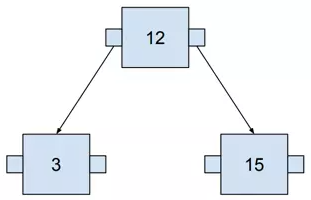
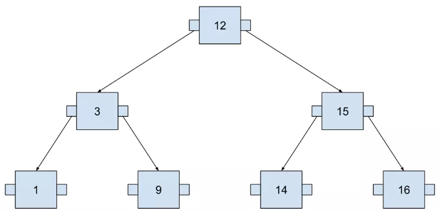
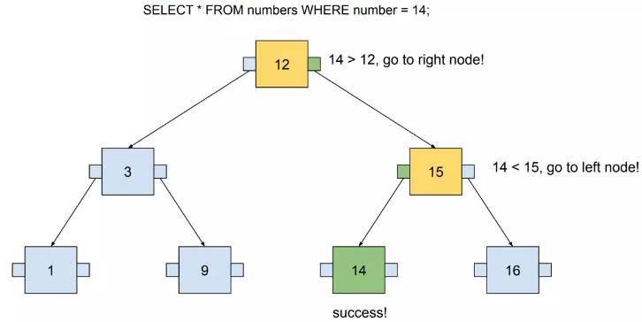
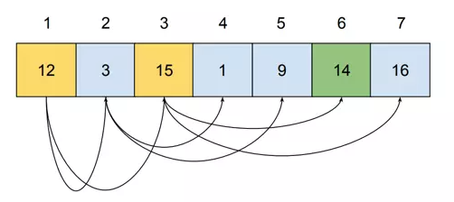
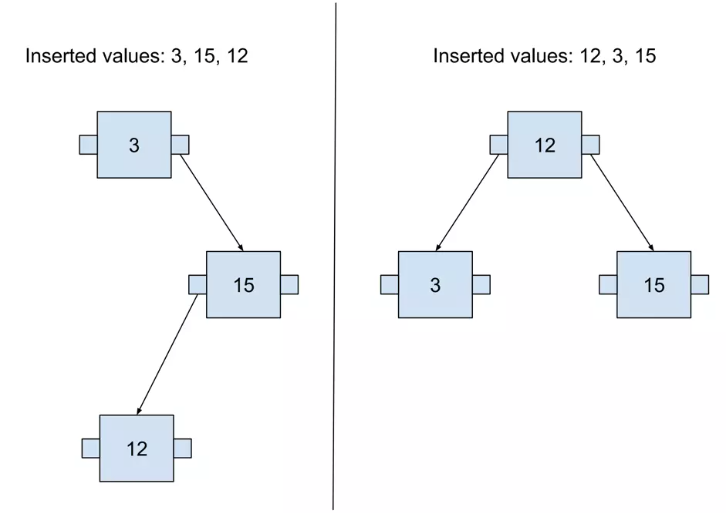
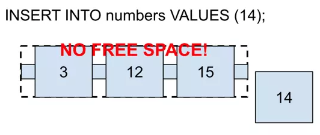
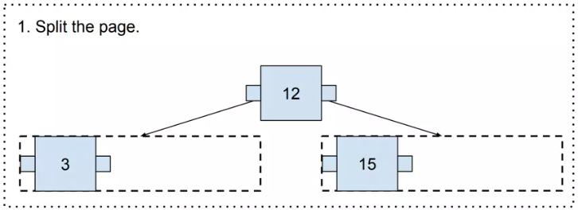
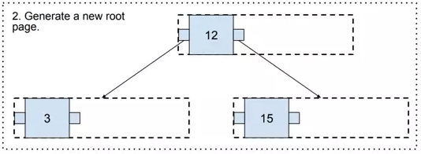
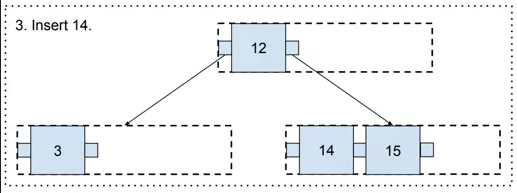

## 写在前头

本篇是 [How does B-tree make your queries fast?](https://blog.allegro.tech/2023/11/how-does-btree-make-your-queries-fast.html) 一文的中文翻译，主要讲述了 B-Tree 是什么以及它的工作原理，解释 B-Tree 针对硬件的数据访问方式而做出的优化 - 顺序访问与节点自平衡算法，搭配图片，使得内容描述更加清晰易懂。

**以下是太长不看版（由 AI 整理）**：

B 树是一种高效的数据结构，它通过优化数据的存储和检索方式，使得数据库查询变得更加迅速。尽管 B 树的概念已经存在了超过 40 年，但它仍然是现代数据库系统中不可或缺的一部分。与二叉搜索树相比，B 树的关键优势在于它能够更好地适应实际的硬件环境，尤其是在处理大量数据时。

在硬件层面，数据可以存储在 CPU 缓存、RAM 或磁盘上。RAM 提供了快速的随机访问能力，但成本较高且数据易失；而磁盘虽然成本低廉且数据持久，但其随机访问速度较慢。为了克服这些限制，B 树通过减少树的高度并增加节点的宽度来优化数据的顺序访问，从而提高了查询效率。

并且 B 树的自平衡特性确保了在添加新数据时，树的结构能够自动调整，保持平衡。这种平衡是通过在节点间合理分配数据来实现的，避免了树的深度增长过快。例如，当一个节点满了，需要分裂时，B 树会选择一个合适的分裂点，将部分数据移动到新的上层节点，从而保持树的平衡。

总的来说，B 树的设计直接针对了实际硬件处理大量数据的需求，这使得它在数据库技术中具有持久的生命力。它的自平衡和顺序访问特性，使其在现代数据库系统中仍然占据着重要地位。

**以下是原文+翻译：**

## B 树如何让您的查询更快？ How does B-tree make your queries fast?

**B-tree** is a structure that helps to search through great amounts of data. It was invented over 40 years ago, yet it is still employed by the majority of modern databases. Although there are newer index structures, like LSM trees, **B-tree** is unbeaten when handling most of the database queries.
B 树是一种有助于搜索大量数据的结构。它是 40 多年前发明的，但仍然被大多数现代数据库所采用。尽管有更新的索引结构，例如 LSM 树，但 B 树在处理大多数数据库查询时是不败的。

After reading this post, you will know how **B-tree** organises the data and how it performs search queries.
读完这篇文章后，您将了解 B 树如何组织数据以及它如何执行搜索查询。

## 起源  Origins

In order to understand **B-tree** let’s focus on **Binary Search Tree (BST)** first.
为了理解 B 树，我们首先关注二叉搜索树（BST）。

Wait, isn’t it the same?
等等，这不是一样吗？

What does “B” stand for then?
那么“B”代表什么？

According to [wikipedia.org](https://en.wikipedia.org/wiki/B-tree), Edward M. McCreight, the inventor of B-tree, once said:
据 wikipedia.org 报道，B 树的发明者 Edward M. McCreight 曾说过：

> “the more you think about what the B in B-trees means, the better you understand B-trees.”
> “你越多地思考 B 树中的 B 的含义，你就越能理解 B 树。”

Confusing **B-tree** with **BST** is a really common misconception. Anyway, in my opinion, BST is a great starting point for reinventing B-tree. Let’s start with a simple example of BST:
将 B 树与 BST 混淆是一个非常常见的误解。无论如何，在我看来，BST 是重新发明 B 树的一个很好的起点。让我们从一个简单的 BST 示例开始：

The greater number is always on the right, the lower on the left. It may become clearer when we add more numbers.
较大的数字始终位于右侧，较小的数字始终位于左侧。当我们添加更多数字时，情况可能会变得更清楚。

This tree contains seven numbers, but we need to visit at most three nodes to locate any number. The following example visualizes searching for 14. I used SQL to define the query in order to think about this tree as if it were an actual database index.
这棵树包含七个数字，但是我们最多需要访问三个节点才能找到任何数字。以下示例可视化搜索 14。我使用 SQL 定义查询，以便将这棵树视为实际的数据库索引。

## 硬件  Hardware

In theory, using Binary Search Tree for running our queries looks fine. Its time complexity (when searching) is $O(logn)$，[same as B-tree](https://en.wikipedia.org/wiki/B-tree). However, in practice, this data structure needs to work on actual hardware. An index must be stored somewhere on your machine.
理论上，使用二叉搜索树来运行我们的查询看起来不错。它的时间复杂度（搜索时）为 $O(logn)$，与 B 树相同。然而，在实践中，这种数据结构需要在实际硬件上工作。索引必须存储在计算机上的某个位置。

The computer has three places where the data can be stored:
计算机可以存储数据的三个地方：

- CPU caches 
  CPU 缓存
- RAM (memory) 
  RAM（内存）
- Disk (storage) 
  磁盘（存储）

The cache is managed fully by CPUs. Moreover, it is relatively small, usually a few megabytes. Index may contain gigabytes of data, so it won’t fit there.
缓存完全由 CPU 管理。而且它比较小，一般只有几兆字节。索引可能包含千兆字节的数据，因此它不适合放在那里。

Databases vastly use Memory (RAM). It has some great advantages:
数据库大量使用内存 (RAM)。它有一些很大的优点：

- assures fast random access (more on that in the next paragraph)
  确保快速随机访问（下一段将详细介绍）
- its size may be pretty big (e.g. AWS RDS cloud service [provides instances](https://aws.amazon.com/rds/instance-types/) with a few terabytes of memory available).
  它的大小可能相当大（例如AWS RDS云服务提供具有几TB可用内存的实例）。

Cons? You lose the data when the power supply goes off. Moreover, when compared to the disk, it is pretty expensive.
缺点？当电源关闭时，您会丢失数据。而且，与磁盘相比，它相当昂贵。

Finally, the cons of a memory are the pros of a disk storage. It’s cheap, and data will remain there even if we lose the power. However, there are no free lunches! The catch is that we need to be careful about random and sequential access. Reading from the disk is fast, but only under certain conditions! I’ll try to explain them simply.
最后，内存的缺点也是磁盘存储的优点。它很便宜，即使我们断电，数据也会保留在那里。然而，天下没有免费的午餐！问题是我们需要小心随机和顺序访问。从磁盘读取速度很快，但仅限于特定条件！我将尝试简单地解释它们。

### 随机和顺序访问  Random and sequential access

Memory may be visualized as a line of containers for values, where every container is numbered.
内存可以被视为一排值的容器，其中每个容器都被编号。

Now let’s assume we want to read data from containers 1, 4, and 6. It requires random access:
现在假设我们要从容器 1、4 和 6 读取数据。它需要随机访问：

And then let’s compare it with reading containers 3, 4, and 5. It may be done sequentially:
然后我们再与​​读取容器3、4、5进行比较。可能是顺序进行的：

The difference between a “random jump” and a “sequential read” can be explained based on Hard Disk Drive. It consists of the head and the disk.
“随机跳转”和“顺序读取”之间的区别可以根据硬盘驱动器来解释。它由磁头和磁盘组成。

“Random jump” requires moving the head to the given place on the disk. “Sequential read” is simply spinning the disk, allowing the head to read consecutive values. When reading megabytes of data, the difference between these two types of access is enormous. Using “sequential reads” lowers the time needed to fetch the data significantly.
“随机跳转”需要将磁头移动到磁盘上的给定位置。 “顺序读取”只是旋转磁盘，让磁头读取连续的值。当读取兆字节的数据时，这两种类型的访问之间的差异是巨大的。使用“顺序读取”可以显着减少获取数据所需的时间。

Differences in speed between random and sequential access were researched in the article “The Pathologies of Big Data” by Adam Jacobs, [published in Acm Queue](https://queue.acm.org/detail.cfm?id=1563874). It revealed a few mind-blowing facts:
Adam Jacobs 发表在 Acm Queue 上的文章“大数据的病理学”研究了随机访问和顺序访问之间的速度差异。它揭示了一些令人震惊的事实：

- Sequential access on HDD may be hundreds of thousands of times faster than random access. 🤯
  HDD 上的顺序访问可能比随机访问快数十万倍。🤯
- It may be faster to read sequentially from the disk than randomly from the memory.
  从磁盘顺序读取可能比从内存随机读取更快。

Who even uses HDD nowadays? What about SSD? This research shows that reading fully sequentially from HDD may be faster than SSD. However, please note that the article is from 2009 and SSD developed significantly through the last decade, thus these results are probably outdated.
现在谁还用HDD？ SSD呢？这项研究表明，从 HDD 完全顺序读取可能比 SSD 更快。然而，请注意，这篇文章是 2009 年的，SSD 在过去十年中取得了显着的发展，因此这些结果可能已经过时了。

To sum up, the key takeaway is **to prefer sequential access wherever we can**. In the next paragraph, I will explain how to apply it to our index structure.
总而言之，关键的一点是尽可能选择顺序访问。在下一段中，我将解释如何将其应用到我们的索引结构中。

## 优化树的顺序访问  Optimizing a tree for sequential access

Binary Search Tree may be represented in memory in the same way as [the heap](https://en.wikipedia.org/wiki/Binary_heap):
二叉搜索树在内存中的表示方式与堆相同：

- parent node position is $i$
  父节点位置为 $i$
- left node position is $2i$
  左节点位置为 $2i$
- right node position is $2i$+1
  右节点位置为 $2i$+1

That’s how these positions are calculated based on the example (the parent node starts at 1):
这就是根据示例计算这些位置的方式（父节点从 1 开始）：

According to the calculated positions, nodes are aligned into the memory:
根据计算出的位置，将节点对齐到内存中：

Do you remember the query visualized a few chapters ago?
您还记得几章前可视化的查询吗？

That’s what it looks like on the memory level:
这就是内存级别的样子：

When performing the query, memory addresses 1, 3, and 6 need to be visited. Visiting three nodes is not a problem; however, as we store more data, the tree gets higher. Storing more than one million values requires a tree of height at least 20. It means that 20 values from different places in memory must be read. It causes completely random access!
执行查询时，需要访问内存地址1、3、6。访问三个节点不是问题；然而，当我们存储更多数据时，树就会变得更高。存储超过一百万个值需要树的高度至少为 20。这意味着必须读取内存中不同位置的 20 个值。它会导致完全随机访问！

### 页数  Pages

While a tree grows in height, random access is causing more and more delay. The solution to reduce this problem is simple: grow the tree in width rather than in height. It may be achieved by packing more than one value into a single node.
当树越来越高时，随机访问会导致越来越多的延迟。减少这个问题的解决方案很简单：增加树的宽度而不是高度。它可以通过将多个值打包到单个节点中来实现。

It brings us the following benefits:
它给我们带来了以下好处：

- the tree is shallower (two levels instead of three)
  树更浅（两层而不是三层）
- it still has a lot of space for new values without the need for growing further
  它仍然有很大的空间容纳新的价值，而不需要进一步增长

The query performed on such index looks as follows:
对此类索引执行的查询如下所示：

Please note that every time we visit a node, we need to load all its values. In this example, we need to load 4 values (or 6 if the tree is full) in order to reach the one we are looking for. Below, you will find a visualization of this tree in a memory:
请注意，每次访问一个节点时，我们都需要加载它的所有值。在此示例中，我们需要加载 4 个值（如果树已满，则加载 6 个值）才能找到我们要查找的值。下面，您将在内存中找到这棵树的可视化：

Compared to [the previous example](#anchor) (where the tree grows in height), this search should be faster. We need random access only twice (jump to cells 0 and 9) and then sequentially read the rest of values.
与前面的示例（树的高度增长）相比，此搜索应该更快。我们只需要随机访问两次（跳转到单元格 0 和 9），然后顺序读取其余值。

This solution works better and better as our database grows. If you want to store one million values, then you need:
随着我们的数据库的增长，这个解决方案的效果越来越好。如果你想存储一百万个值，那么你需要：

- Binary Search Tree which has **20** levels
  二叉搜索树有 20 层

OR

- 3-value node Tree which has **10** levels
  具有 10 个级别的 3 值节点树

Values from a single node make a page. In the example above, each page consists of three values. A page is a set of values placed on a disk next to each other, so the database may reach the whole page at once with one sequential read.
来自单个节点的值构成一个页面。在上面的示例中，每个页面包含三个值。页是放置在磁盘上彼此相邻的一组值，因此数据库可以通过一次顺序读取一次到达整个页。

And how does it refer to the reality? [Postgres page size is 8kB](https://www.postgresql.org/docs/current/storage-toast.html#:~:text=PostgreSQL-uses-a-fixed-page,tuples-to-span-multiple-pages.). Let’s assume that 20% is for metadata, so it’s 6kB left. Half of the page is needed to store pointers to node’s children, so it gives us 3kB for values. BIGINT size is 8 bytes, thus we may store ~375 values in a single page.
它如何指代现实？ Postgres 页面大小为 8kB。假设 20%（应该是 25%） 用于元数据，因此还剩下 6kB。需要一半的页面来存储指向节点子节点的指针，因此它为我们提供了 3kB 的值。 BIGINT 大小为 8 个字节，因此我们可以在单个页面中存储约 375 个值。

Assuming that some pretty big tables in a database have one billion rows, how many levels in the Postgres tree do we need to store them? According to the calculations above, if we create a tree that can handle 375 values in a single node, it may store **1 billion** values with a tree that has only **four** levels. Binary Search Tree would require 30 levels for such amount of data.
假设数据库中一些相当大的表有 10 亿行，我们需要在 Postgres 树中有多少层来存储它们？根据上面的计算，如果我们创建一棵可以在单个节点中处理 375 个值的树，那么它可以用只有四个级别的树存储 10 亿个值。对于如此大量的数据，二叉搜索树需要 30 个级别。

To sum up, placing multiple values in a single node of the tree helped us to reduce its height, thus using the benefits of sequential access. Moreover, a B-tree may grow not only in height, but also in width (by using larger pages).
总而言之，将多个值放置在树的单个节点中有助于我们降低其高度，从而利用顺序访问的好处。此外，B 树不仅可以在高度上增长，而且可以在宽度上增长（通过使用更大的页面）。

## 平衡  Balancing

There are two types of operations in databases: writing and reading. In the previous section, we addressed the problems with reading the data from the B-tree. Nonetheless, writing is also a crucial part. When writing the data to a database, B-tree needs to be constantly updated with new values.
数据库中有两种操作：写和读。在上一节中，我们解决了从 B 树读取数据的问题。尽管如此，写作也是至关重要的一部分。将数据写入数据库时​​，B 树需要不断更新新值。

The tree shape depends on the order of values added to the tree. It’s easily visible in a binary tree. We may obtain trees with different depths if the values are added in an incorrect order.
树的形状取决于添加到树中的值的顺序。它在二叉树中很容易看到。如果以不正确的顺序添加值，我们可能会获得不同深度的树。

When the tree has different depths on different nodes, it is called an unbalanced tree. There are basically two ways of returning such a tree to a balanced state:
当树在不同节点上具有不同的深度时，称为不平衡树。基本上有两种方法可以使这样的树恢复平衡状态：

1. Rebuilding it from the very beginning just by adding the values in the correct order.
   只需按照正确的顺序添加值即可从头开始重建它。
2. Keeping it balanced all the time, as the new values are added.
   随着新值的添加，始终保持平衡。

B-tree implements the second option. A feature that makes the tree balanced all the time is called self-balancing.
B 树实现了第二个选项。使树始终保持平衡的一个特性称为自平衡。

### 自平衡算法示例  Self-balancing algorithm by example

Building a B-tree can be started simply by creating a single node and adding new values until there is no free space in it.
构建 B 树可以简单地通过创建单个节点并添加新值直到其中没有可用空间来开始。

If there is no space on the corresponding page, it needs to be split. To perform a split, a „split point” is chosen. In that case, it will be 12, because it is in the middle. The „Split point” is a value that will be moved to the upper page.
如果对应页面没有空间，则需要进行拆分。要执行分割，需要选择“分割点”。在这种情况下，它将是 12，因为它位于中间。 “分割点”是将移动到上页的值。

Now, it gets us to an interesting point where there is no upper page. In such a case, a new one needs to be generated (and it becomes the new root page!).
现在，它让我们看到一个有趣的点，即没有上页。在这种情况下，需要生成一个新的页面（并且它成为新的根页面！）。

And finally, there is some free space in the three, so value 14 may be added.
最后，三个中还有一些可用空间，因此可以添加值 14。

Following this algorithm, we may constantly add new values to the B-tree, and it will remain balanced all the time!
按照这个算法，我们可以不断地向B树添加新的值，并且它会一直保持平衡！

*At this point, you may have a valid concern that there is a lot of free space that has no chance to be filled. For example, values 14, 15, and 16, are on different pages, so these pages will remain with only one value and two free spaces forever.
此时，您可能会担心有大量可用空间没有机会被填充。例如，值 14、15 和 16 位于不同的页面上，因此这些页面将永远仅保留一个值和两个可用空间。*

*It was caused by the split location choice. We always split the page in the middle. But every time we do a split, we may choose any split location we want.
这是由于分割位置选择造成的。我们总是将页面从中间分开。但每次我们进行分割时，我们都可以选择任何我们想要的分割位置。*

*Postgres has an algorithm that is run every time a split is performed! Its implementation may be found in the [_bt_findsplitloc() function in Postgres source code](https://github.com/postgres/postgres/blob/54ccfd65868c013a8c6906bc894bc5ea3640740a/src/backend/access/nbtree/nbtsplitloc.c#L87). Its goal is to leave as little free space as possible.
Postgres 有一个算法，每次执行分割时都会运行！它的实现可以在 Postgres 源代码中的 _bt_findsplitloc() 函数中找到。其目标是留下尽可能少的自由空间。*

## 概括  Summary

In this article, you learned how a B-tree works. All in all, it may be simply described as a Binary Search Tree with two changes:
在本文中，您了解了 B 树的工作原理。总而言之，它可以简单地描述为二叉搜索树，有两个变化：

- every node may contain more than one value
  每个节点可能包含多个值
- inserting a new value is followed by a self-balancing algorithm.
  插入新值之后是自平衡算法。

Although the structures used by modern databases are usually some variants of a B-tree (like B+tree), they are still based on the original conception. In my opinion, one great strength of a B-tree is the fact that it was designed directly to handle large amounts of data on actual hardware. It may be the reason why the B-tree has remained with us for such a long time.
尽管现代数据库使用的结构通常是 B 树的一些变体（例如 B+ 树），但它们仍然基于原始概念。在我看来，B 树的一大优势在于它是直接设计用于在实际硬件上处理大量数据的。这可能就是 B 树陪伴我们这么久的原因。
