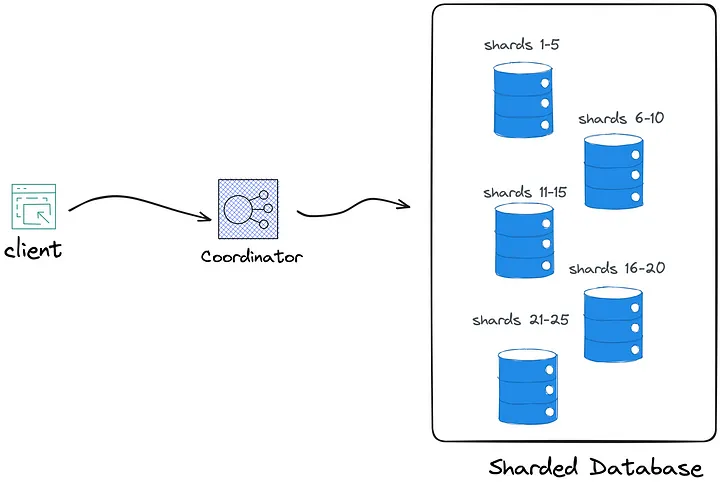
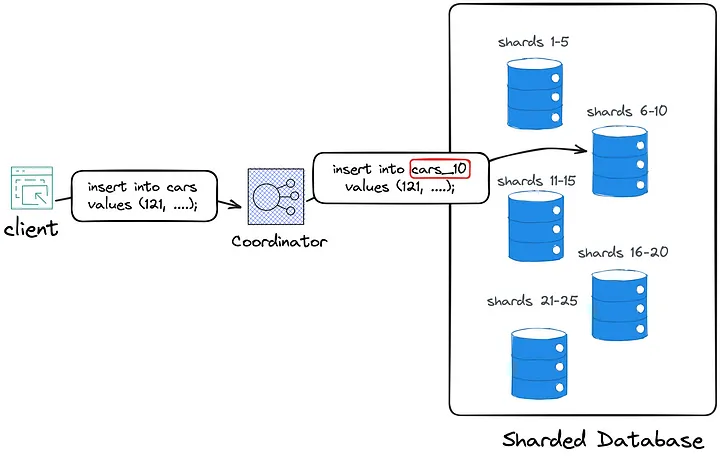
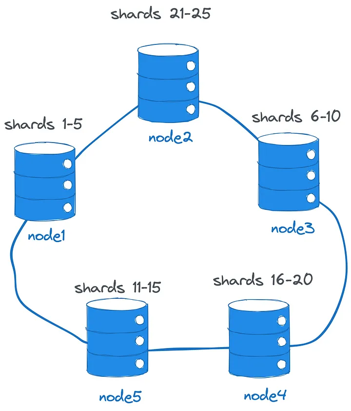
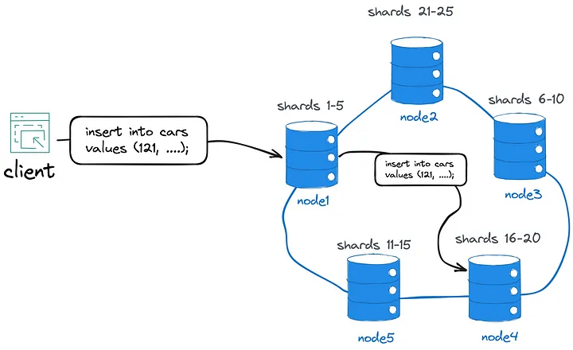

## 写在前头

本篇是 [Sharded Does Not Imply Distributed](https://medium.com/@magda7817/sharded-does-not-imply-distributed-572fdafc4040) 一文的翻译。对于后端人员来说，分片的概念并不陌生，诸如 ElasticSearch、Redis、MySQL 等数据库都有针对于分片的实现方案来解决某些业务场景。文中对数据库分片与分布式数据库的主要区别做了说明，但请注意：**分片数据库也是分布式系统**。

**以下是太长不看版（由 AI 整理）**：

文章《分片并不意味着分布式》主要讨论了数据库分片（Sharding）与分布式数据库（Distributed Databases）之间的区别：

1. **分片（Sharding）**：分片是一种技术，它通过将原始数据集拆分为多个分片（shards），并将这些分片分布在多个独立的数据库实例上来实现水平可扩展性。分片解决方案的关键组件是协调器（coordinator），它负责了解数据分布并映射客户端请求到特定的分片和数据库实例。分片数据库实例不相互通信，它们存在于孤立的环境中。
2. **分布式数据库**：分布式数据库采用分片技术在数据库节点集群中分布数据和负载，但它们建立在无共享架构之上，不依赖于协调器组件。集群中的所有节点都了解彼此和数据分布，可以直接路由客户端请求到适当的分片所有者，并执行多节点事务。分布式数据库在扩展时会自动重新平衡和拆分分片，节点维护数据的冗余副本，即使部分节点故障也能继续操作。
3. **分片与分布式的区别**：分片涉及将数据拆分到多个独立实例，但这并不意味着系统是分布式的（单机多实例）。分布式数据库则没有中央协调器，其节点相互了解，管理数据分布，并无缝处理客户端请求。
4. **数据库设计选择**：理解分片和分布式数据库的细微差别对于数据库的设计和选择至关重要，因为它们各自有不同的优点和适用场景。

文章也提到，如果读者对分片数据库架构感兴趣，可以考虑探索 CitusData 或 Azure CosmosDB for PostgreSQL、Vitess for MySQL、Oracle Distributed Autonomous Database 和 MongoDB Sharded Cluster。而对于真正的分布式数据库架构，可以考虑研究 Google Spanner、YugabyteDB、CockroachDB、Apache Cassandra 或 Apache Ignite。

**以下是原本+翻译：**

## 分片并不意味着分布式  Sharded Does Not Imply Distributed

Sharding is a technique that distributes data and load across several standalone database instances. This method leverages horizontal scalability by splitting the original dataset into shards, which are then distributed across multiple database instances.
分片是一种在多个独立数据库实例之间分配数据和负载的技术。此方法通过将原始数据集拆分为分片，然后将其分布在多个数据库实例中来利用水平可扩展性。

But, even though the verb “distributes” appears in the definition of sharding, a sharded database is not a distributed one.
但是，即使分片的定义中出现了动词“分布”，分片数据库也不是分布式数据库。

## 分片解决方案  Sharding Solutions

Every sharding solution has one critical component in its architecture. This component can go by various names, including coordinator, router, or director:
每一种分片解决方案的架构中都有一个关键组件。该组件可以有各种名称，包括协调器、路由器或导向器：

The coordinator is the sole component aware of data distribution. It maps client requests to specific shards and then to the corresponding database instance. This is why clients must always route their requests through the coordinator.
协调器是唯一了解数据分布的组件。它将客户端请求映射到特定的分片，然后映射到相应的数据库实例。这就是为什么客户端必须始终通过协调器路由其请求。

For example, if a client wants to insert a new record into the `Car`table, the request first goes to the coordinator. The coordinator maps the record’s primary key to one of the shards and then forwards the request to the database instance responsible for that shard.
例如，如果客户端想要将新记录插入 `Car` 表中，则请求首先发送到协调器。协调器将记录的主键映射到其中一个分片，然后将请求转发到负责该分片的数据库实例。

In the schema above, first, the coordinator maps key `121` to shard `10` and, second, inserts the record into table `car_10` that is stored on the database instance owning shard `10`
在上面的架构中，首先，协调器将键 `121` 映射到分片 `10` ，然后将记录插入到存储在数据库实例上的表 `car_10` 中拥有分片 `10`

However, one question remains: Why is the coordinator even needed in sharding solutions? The answer is straightforward. The shards are stored on database instances designed for single-server deployments.
然而，仍然存在一个问题：为什么分片解决方案中甚至需要协调器？答案很简单。分片存储在专为单服务器部署而设计的数据库实例上。

*These database instances do not communicate with each other, nor do they support any protocols that would facilitate such communication. Unaware of each other, they exist in their own isolated environments, oblivious to the fact that they are part of a larger system.
这些数据库实例不相互通信，也不支持任何促进此类通信的协议。他们彼此不知情，存在于自己孤立的环境中，没有意识到自己是一个更大系统的一部分。*

Consequently, the coordinator is indispensable in sharding solutions. If you’re interested in delving deeper into sharded database architectures, consider exploring CitusData or Azure CosmosDB for PostgreSQL, Vitess for MySQL, Oracle Distributed Autonomous Database, and MongoDB Sharded Cluster.
因此，协调器在分片解决方案中是不可或缺的。如果您有兴趣深入研究分片数据库架构，请考虑探索 CitusData 或 Azure CosmosDB for PostgreSQL、Vitess for MySQL、Oracle 分布式自治数据库和 MongoDB 分片集群。

## 分布式数据库  Distributed Databases

Much like sharded database solutions, distributed databases also employ similar sharding techniques to distribute data and load across a cluster of database nodes. However, unlike sharding solutions, distributed databases do not rely on a coordinator component.
与分片数据库解决方案非常相似，分布式数据库也采用类似的分片技术来跨数据库节点集群分布数据和加载。然而，与分片解决方案不同，分布式数据库不依赖于协调器组件。

**Distributed databases are built on a shared-nothing architecture**, which doesn’t have a single component, like the coordinator, burdened with making numerous decisions:
**分布式数据库建立在无共享架构之上**，该架构没有像协调器这样的单一组件，需要做出大量决策：

*All nodes in the cluster are aware of each other and, consequently, the data distribution. By communicating directly, each node can route a client request to the appropriate shard owner. Additionally, they can execute and coordinate multi-node transactions. When scaling to more nodes, the cluster automatically rebalances and splits shards. The nodes maintain redundant copies of data (based on a configured replication factor) and can continue operations without downtime, even if some nodes fail.
集群中的所有节点都了解彼此，从而了解数据分布。通过直接通信，每个节点都可以将客户端请求路由到适当的分片所有者。此外，它们还可以执行和协调多节点交易。当扩展到更多节点时，集群会自动重新平衡并拆分分片。节点维护数据的冗余副本（基于配置的复制因子），并且即使某些节点出现故障，也可以在不停机的情况下继续操作。*

All of this operates transparently for the client, who simply needs to establish a connection with any of the nodes and allow that node to manage the distributed aspects.
所有这些对客户端来说都是透明的，客户端只需与任何节点建立连接并允许该节点管理分布式方面。

For example, a client might connect to `node1` and insert a new `Car` record with the id `121`. If `node1` is the owner of the record’s shard, then it will store the record locally and employ a consensus algorithm to replicate the change to a subset of other nodes. If not, `node1` will forward the record to the shard’s owner, which might be `node4`.
例如，客户端可能连接到 `node1` 并插入 ID 为 `121` 的新 `Car` 记录。如果 `node1` 是记录分片的所有者，那么它将在本地存储该记录，并采用共识算法将更改复制到其他节点的子集。如果不是， `node1` 会将记录转发给分片的所有者，该所有者可能是 `node4` 。

If you’re interested in exploring the architectures of genuine distributed databases, consider looking into Google Spanner, YugabyteDB, CockroachDB, Apache Cassandra, or Apache Ignite.
如果您有兴趣探索真正的分布式数据库的架构，请考虑研究 Google Spanner、YugabyteDB、CockroachDB、Apache Cassandra 或 Apache Ignite。

In the realm of databases, sharding and distribution are often conflated, but they serve distinct purposes.
在数据库领域，分片和分布经常被混为一谈，但它们有不同的目的。

While sharding involves splitting data across multiple standalone instances, it doesn’t inherently mean the system is distributed. The presence of a coordinator in sharding solutions, which directs client requests to the appropriate shard, underscores this distinction.
虽然分片涉及将数据拆分到多个独立实例中，但这并不意味着系统本质上是分布式的。分片解决方案中协调器的存在，将客户端请求引导到适当的分片，强调了这种区别。

On the other hand, distributed databases, built on a shared-nothing architecture, lack this centralized coordinator. Nodes in these systems are aware of each other, manage data distribution, and handle client requests seamlessly.
另一方面，建立在无共享架构之上的分布式数据库缺乏这种集中的协调器。这些系统中的节点相互了解、管理数据分发并无缝处理客户端请求。

Both architectures have their merits, and understanding their nuances is crucial for informed database design and selection.
两种架构都有其优点，了解它们的细微差别对于明智的数据库设计和选择至关重要。
