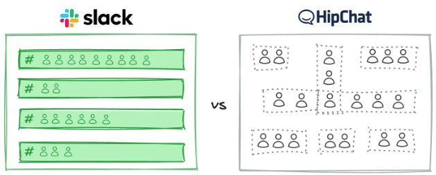
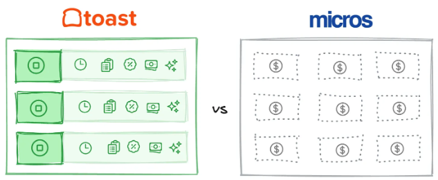
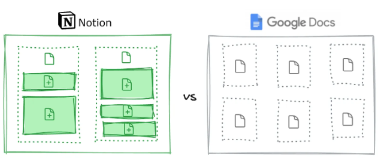
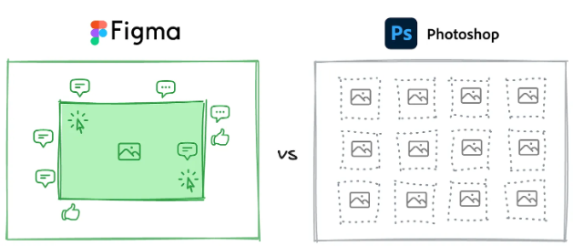
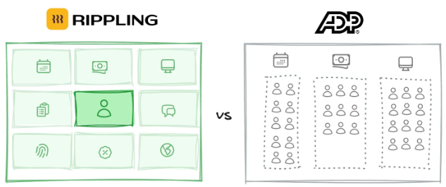
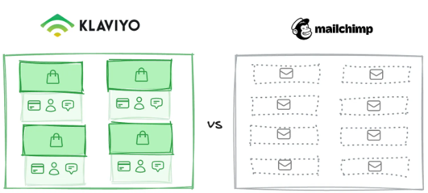
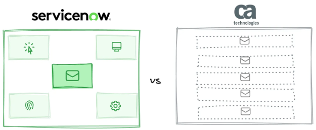

## 写在前头

本篇是 [Your data model is your destiny](https://notes.mtb.xyz/p/your-data-model-is-your-destiny) 一文的中文翻译。在 AI 拉平代码门槛的今天，产品的“护城河”是什么？文章通过案例雄辩地证明：真正的护城河并非“创意”，而是那个在早期就已定型、并决定后续复利优势的**数据模型**。

**以下是太长不看版（由 AI 整理）**：

数据模型对初创公司的产品设计和未来发展方向具有决定性影响，它不仅体现在数据库架构中，更影响着 UI 设计、定价策略、市场推广等方方面面，是连接产品与市场的核心纽带。

每个创始人都有自己的数据模型（无论是否明确），一旦架构固化就很难更改。多数公司无需在数据模型上创新，因为客户已习惯现有工具的逻辑；但在颠覆巨头或创造新类别时，独特的数据模型会成为关键优势。

过去十年的成功企业，都靠早期的数据模型选择实现突破：
- **Slack** 用“*持久化可搜索频道*”替代临时群聊，形成组织记忆；
- **Toast** 将“*菜单项*”作为核心，嵌入餐厅运营逻辑，自然扩展出库存、人力管理功能；
- **Notion** 以“*可重组模块*”替代传统文档，整合多种工具功能；
- **Figma** 用“*共享网络画布*”解决本地文件的版本混乱问题；
- **Rippling** 以“*员工记录*”为枢纽，让 HR、IT 等模块自动共享完整上下文；
- **Klaviyo** 将“*订单数据*”与邮件数据同等对待，优化客户终身价值管理；
- **ServiceNow** 将工单与“*服务地图*”关联，推动 IT 从解决问题转向预防问题。

如今，AI 让代码变得普及，技术执行不再是竞争壁垒，数据模型反而成为护城河的基础。在拥挤的市场中，单一产品难以立足，而优质的数据模型能创造竞争对手无法复制的复利优势 —— 新功能可借助既有数据自动增强，就像 Toast 从 “菜单项” 自然延伸到供应链管理一样。

设计数据模型时，水平工具（服务广泛场景）应侧重技术与界面创新，垂直工具（服务特定行业）需聚焦领域核心对象。关键是从工作流出发，找到 “工作的原子单元”（如餐厅的 “菜单项”），避免现有产品中的 “模型错配”（即客户被迫用变通方案适配产品）。

若已建成产品，可通过数据库外键分布、核心操作是否围绕中心对象、删除次要表的影响等方式，验证模型有效性。真正有价值的数据模型，能让新增功能借助既有数据自然成长，形成独特的扩展路径。

总之，数据模型决定产品命运。尽管它是在对市场了解最少时做出的选择，但一旦正确，竞争对手因基础不同难以复制，而企业可借此不断积累优势，拉开差距。

**以下是原文+翻译：**

## 数据模型即命运  Your data model is your destiny

> Your product's core abstractions determine whether new features compound into a moat or just add to a feature list. Here's how to get it right.
> 你的产品的核心抽象，决定了新功能是会“复利”成护城河，还是仅仅在功能清单上“堆砌”。本文将探讨如何做对。

Product market fit is the startup holy grail. “Product” and “market” are essential, but a startup’s data model is the dark matter that holds them together.
PMF (产品市场契合度) 是初创公司的圣杯。产品和市场固然至关重要，但初创公司的数据模型才是将它们维系在一起的“暗物质”。

**“Data model” refers to what a startup emphasizes in its product, i.e., which parts of reality matter most in how the product represents the world.** It’s the core concepts or objects a startup prioritizes and builds around, the load-bearing assumptions at the heart of their strategy and worldview. It’s partially captured in the database architecture (hence the name), but it shapes everything from the UI/UX to the product marketing, pricing model, and GTM strategy.
**“数据模型”指的是一家初创公司在其产品中“强调”什么，即在产品如何“表征”世界时，现实的哪些部分“最重要”。** 它是初创公司优先考虑并围绕其构建的核心概念或对象，是其战略和世界观核心的“承重假设”。它部分体现在数据库架构中（因此而得名），但它塑造了一切——从 UI/UX 到产品营销、定价模型和 GTM (市场推广) 策略。

This shows up differently depending on the layer. In the database, it’s which tables are central and how they relate. In the product, it’s which UI elements dominate and what actions are easiest. In pricing, it’s what you charge by. In GTM, it’s the workflow or pain point you lead with. But they all stem from the same choice about what deserves to be the center of gravity.
这在不同层面上表现不同。在数据库中，它是指哪些表是“中心”以及它们如何关联。在产品中，它是指哪些 UI 元素“主导”着界面，以及哪些操作“最容易”执行。在定价中，它是你的“收费依据”。在 GTM 中，它是你主打的“工作流”或“痛点”。但它们都源于同一个选择：什么才配得上成为“重心”。

Every founder has a data model, whether they realize it or not. Either you choose it explicitly or it gets inherited from whatever you’re copying. Most founders never articulate it. By the time the architecture solidifies around these implicit choices, it’s nearly impossible to change.
每个创始人都有一个数据模型，无论他们是否意识到。你要么明确地选择它，要么它就从你抄袭的任何东西中“继承”而来。大多数创始人从未明确阐述过它。而当架构围绕这些“隐性”选择固化时，它几乎不可能再改变。

And that’s generally fine, because most companies shouldn’t innovate on their data model. Customers have existing mental models and workflows built around incumbent tools. Fighting that is expensive and slow. But at the extreme ends of markets—where you’re toppling multi-billion-dollar incumbents or creating entirely new categories—a distinctive data model becomes a critical and non-obvious edge.
这通常没什么问题，因为大多数公司本就“不应该”在数据模型上创新。客户已有的心智模型和工作流是围绕着现有的霸主工具建立的，对抗这一点既昂贵又缓慢。但在市场的“极端”，即当你试图推翻数十亿美元的巨头或创造全新类别时，一个“独特”的数据模型就成了关键且“不易察觉”的优势。

The biggest breakout companies of the last decade often trace their success to an early, non-obvious data model choice that seemed minor at the time but proved decisive. Consider:
过去十年中，那些“一鸣惊人”的公司，其成功往往可以追溯到一个“早期”的、“不易察觉”的数据模型选择，这个选择在当时看来微不足道，但最终被证明是“决定性”的。例如：

- **Slack’s persistent channels vs 1\:1/group messages:** While Yammer and HipChat replicated email’s ephemeral group messages, Slack made persistent, searchable channels the atomic unit. This created organizational memory—every decision, discussion, and document lives forever in context. Incumbents couldn’t match this without rebuilding from scratch.
**Slack 的“持久化频道” vs “1\:1/群组消息”：** 当 Yammer 和 HipChat 还在复制 Email 那种阅后即焚的群聊时，Slack 让持久化、可搜索的频道成为了“原子单元”。这创造了组织记忆——每一个决策、讨论和文档都永远活在上下文中。现有的巨头们不从头重构就无法与此匹敌。

- **Toast’s menu-item-centric architecture vs generic POS SKUs:** Toast makes menu items first-class objects with embedded restaurant logic—prep times, kitchen routing, and modifier hierarchies built in. Generic point-of-sale systems treat menu items as retail SKUs, requiring third-party integrations for kitchen workflows. Toast’s model enables native order routing and real-time kitchen management, plus natural extensions like ingredient-level inventory and prep-based labor scheduling—creating a locked-in ecosystem that becomes the restaurant’s operational backbone.
**Toast 的“菜单项中心”架构 vs 通用 POS 的“SKU”：** Toast 将“菜单项”视为“一等公民”，内嵌了餐厅逻辑——备餐时间、后厨路由和配料层级。而通用的 POS 系统只把菜单项当作零售“SKU”（库存单位），厨房工作流需要第三方集成。Toast 的模型实现了原生的订单路由和实时后厨管理，并能自然扩展到“原料级”库存和“备餐式”劳动力调度——创造了一个“锁定”的生态系统，成为餐厅的运营支柱。

- **Notion’s blocks vs Google’s documents:** Google Docs gives you documents; Notion gives you Lego blocks. Every piece of content can be rearranged, nested, or transformed into databases, kanban boards, or wikis. This modularity collapses entire tool categories into one system. Traditional tools can’t compete without abandoning their document-centric architecture.
**Notion 的“块” vs Google 的“文档”：** Google Docs 给你“文档”；Notion 给你“乐高积木”。每块内容都可以被重排、嵌套或转换为数据库、看板和维基。这种“模块化”将整个工具类别“折叠”进一个系统。传统工具不放弃其“文档中心”架构就无法竞争。

- **Figma’s canvas vs files:** Photoshop and Sketch are built on local files. Figma is built on a shared web canvas where everyone sees changes instantly. This eliminates version conflicts and “final_final_v2” chaos. Adobe couldn’t respond without deprecating their entire desktop-first ecosystem.
**Figma 的“画布” vs “文件”：** Photoshop 和 Sketch 建立在“本地文件”之上。Figma 建立在“共享的网络画布”之上，每个人都能即时看到变更。这消除了版本冲突和“final_final_v2”的混乱。Adobe 不“废弃”其整个“桌面优先”的生态系统就无法回应。

- **Rippling’s employee data model vs siloed tools:** Rippling treats the employee record as the lynchpin connecting HR, IT, payroll, and finance. Not separate products sharing data, but one product with multiple views. Each new product module is automatically more powerful than standalone alternatives because it inherits full employee context. Competitors remain trapped in single categories or attempt inferior integrations.
**Rippling 的“员工数据模型” vs “孤岛式工具”：** Rippling 将“员工记录”视为连接 HR、IT、薪酬和财务的“关键枢纽”。它不是“共享数据”的“独立产品”，而是“一个产品”的“多种视图”。每个新产品模块都会“自动”比独立竞品更强大，因为它“继承”了完整的员工上下文。竞争对手则被困在单一类别中，或尝试着蹩脚的集成。

- **Klaviyo’s order-centric data model vs email-centric tools:** MailChimp optimizes for email campaigns. Klaviyo optimizes for customer lifetime value by making order data a first-class citizen alongside emails. This lets e-commerce brands segment by purchase behavior, not just email engagement. Generic email tools can’t match this without rebuilding for vertical-specific data.
**Klaviyo 的“订单中心”数据模型 vs “邮件中心”工具：** MailChimp 为“邮件营销活动”优化。Klaviyo 则通过将“订单数据”提升为与“邮件数据”同等的“一等公民”，来为“客户终身价值”优化。这使得电商品牌能够按“购买行为”而不仅仅是“邮件参与度”来细分客户。通用的邮件工具不针对“垂直领域”的数据进行重构就无法匹敌。

- **ServiceNow’s connected services vs standalone tickets:** Traditional help desks treat tickets like isolated emails. ServiceNow links every ticket to a service map—showing which system is down, who owns it, and what it affects downstream. This transforms IT from ticket-closing to problem-preventing, making ServiceNow irreplaceable once companies reorganize operations around this model.
**ServiceNow 的“互联服务” vs “独立工单”：** 传统的“帮助台”把工单当作“孤立的邮件”。ServiceNow 将每张工单“关联”到一张“服务地图”——显示哪个系统宕机了、谁负责、下游会影响什么。这将 IT 从“关闭工单”转变为“预防问题”，一旦公司围绕这个模型重组了运营，ServiceNow 就变得“不可替代”。

## 数据模型现在比以往任何时候都更重要  Data models matter more than ever now

The importance of a differentiated data model is rising dramatically. AI is commoditizing code. Technical execution is table stakes rather than a competitive advantage. AI can generate code, but it can’t refactor the organizational reality customers have built around your architecture—the workflows, integrations, and institutional muscle memory that compound over time.
差异化数据模型的重要性正在急剧上升。**AI 正在“商品化”代码**。技术执行力已是标配，而不再是竞争优势。AI 可以生成代码，但它无法“重构”客户围绕你的架构所建立的“组织现实”——那些随时间“复利”增长的工作流、集成和“制度化的肌肉记忆”。

Meanwhile, many markets have become so crowded that single-product companies can’t survive. This is particularly true in vertical markets, where companies are [expanding into adjacent software products](https://notes.mtb.xyz/p/invisible-asymptotes-vertical-software), [embedding payments](https://notes.mtb.xyz/p/payfac-1000-words) and [other financial products](https://notes.mtb.xyz/p/embedded-fintech-1000-words), and even [competing with their customers’ labor and supply chains with AI and managed marketplaces](https://notes.mtb.xyz/p/vc-pe-envy).
与此同时，许多市场已变得如此拥挤，以至于“单一产品”公司无法生存。在垂直市场尤其如此，公司正在[拓展到相关的软件产品](https://notes.mtb.xyz/p/invisible-asymptotes-vertical-software)，[嵌入支付](https://notes.mtb.xyz/p/payfac-1000-words)和[其他金融产品](https://notes.mtb.xyz/p/embedded-fintech-1000-words)，甚至[通过 AI 和托管市场与客户的劳动力和供应链竞争](https://notes.mtb.xyz/p/vc-pe-envy)。

**This all points to the same conclusion: when code is cheap, competition is fierce, and vertical depth matters, your data model is the foundation of your moat. The companies that win won’t be those with the most or even the best features. AI will democratize those. The winners will be built on a data model that captures something true about their market, which in turn creates compounding advantages competitors can’t replicate.**
**这一切都指向同一个结论：当代码廉价、竞争激烈、垂直深度至关重要时，你的数据模型就是你护城河的基石。获胜的公司不会是那些功能最多甚至最好的。AI 将使这些“民主化”。胜利者将建立在一个捕捉到市场“真相”的数据模型之上，而这个模型又能反过来创造出竞争对手无法复制的“复利优势”。**

Consider how this plays out. Rippling’s employee-centric model made it trivial to add payments, benefits, and spend management. Each new product inherits rich context, making it instantly more powerful than standalone alternatives. Toast’s menu-item architecture naturally extended to inventory, labor, and supplier management. The data model wasn’t just their first product decision. It was their platform destiny.
想想这是如何发生的。Rippling 以“员工为中心”的模型使得添加支付、福利和支出管理变得轻而易举。每个新产品都“继承”了丰富的上下文，使其瞬间就比独立竞品更强大。Toast 的“菜单项”架构自然地扩展到了库存、劳动力和供应商管理。数据模型不仅仅是他们最初的产品决策，更是他们的“平台命运” (platform destiny)。

## 设计正确的数据模型  Designing the right data model

The path to a differentiated data model depends on your market. The more horizontal you go, the more your moat comes from technical and interface innovation. The more vertical you go, the more your moat comes from elevating the right domain objects with the right attributes.
通往差异化数据模型的路径取决于你的市场。你越“水平化”，你的护城河就越来自“技术”和“界面”的创新。你越“垂直化”，你的护城河就越来自用正确的属性提升正确的“领域对象”。

**Horizontal tools serve broad use cases where underlying concepts are already familiar. Leverage comes from changing how the product is built or experienced.** Notion reimagined documents as composable blocks. Figma rebuilt the foundation entirely as a multiplayer web canvas.
**“水平工具”服务于广泛的用例，其底层概念已为大众所熟知。杠杆来自于改变产品的“构建”或“体验”方式。** Notion 将文档重构为“可组合的块”。Figma 则将基础完全重构为“多人协作的网络画布”。

**[Vertical tools](https://notes.mtb.xyz/p/vertical-ai-beware-what-you-wrap) serve specific industries with deep domain complexity. Leverage comes from what you choose to emphasize.** Toast elevated menu items—not transactions—with prep times and kitchen routing as first-class data. Klaviyo promoted order data to equal status alongside email metrics.
**[垂直工具](https://notes.mtb.xyz/p/vertical-ai-beware-what-you-wrap)服务于具有深度领域复杂性的特定行业。杠杆来自于你“选择强调”什么。** Toast 提升了“菜单项”（而非交易），将备餐时间和后厨路由作为“一等公民”数据。Klaviyo 将“订单数据”提升到与“邮件指标”同等的地位。

A good place to start is by looking for model mismatches in existing successful products. Where are incumbent products forcing an incorrect or outdated model on their customers? Where are customers using workarounds—spreadsheets, low/no code tools, extensive in-product configuration—to make the product match how they think and work?
一个好的起点是去寻找现有成功产品中的“模型错配” (model mismatches)。现有的霸主产品在哪些地方强迫客户使用“错误”或“过时”的模型？客户在哪些地方使用变通方案——电子表格、低代码/无代码工具、大量的内部配置——来让产品匹配他们的思考和工作方式？

Despite all the emphasis on data models, start with the workflow, not the technical implementation. Don’t ask “what data do we need to store?” Ask “what’s the atomic unit of work in this domain?” For restaurants it’s the menu item. For design it’s the canvas. For employee operations it’s the human.
尽管我们如此强调数据模型，但请从工作流开始，而不是技术实现。不要问“我们需要存储什么数据？”，而要问“这个领域中‘工作的原子单元’是什么？” 对餐厅来说，它是“菜单项”。对设计来说，它是“画布”。对员工运营来说，它是“人”。

If you’ve already built a product, you can audit how powerful and correct your data model is. Open your database schema and see which table has the most foreign keys pointing to it. Is that the atomic unit your customers actually think in? List your product’s core actions. Do they all strengthen one central object, or are you building a feature buffet? What would break if you deleted your second-most important table? If the answer is “not much,” you probably have the wrong data model.
如果你已经构建了产品，你可以审计你的数据模型有多么强大和正确。打开你的数据库 Schema，看看哪张表的外键指向它最多。这真的是你客户思考时的原子单元吗？列出你产品的核心操作。它们都是在强化一个中心对象，还是你只是在构建一个功能自助餐？如果你删掉第二重要的表，会发生什么？如果答案是没啥大事，那你可能用错了数据模型。

Test whether your data model creates compound advantages. When you add a new feature or product, does it automatically become more powerful because of data you’re already capturing? If your answer is “we’d need to build that feature from scratch with no inherited context,” you don’t have a compounding data model—you have a product suite. The right model creates natural expansion paths that feel obvious in retrospect but were invisible to competitors.
测试你的数据模型是否创造了“复利优势”。当你添加一个新功能或新产品时，它是否因为你已在捕获的数据而自动变得更强大？如果你的答案是“我们需要在没有继承任何上下文的情况下从零开始构建那个功能”，那么你拥有的不是一个复利数据模型——你拥有的只是一个产品套件。正确的模型会创造出自然的扩展路径，这些路径在事后看来显而易见，但对你的竞争对手来说却是隐形的。

## 结论  Conclusion

Your data model is your destiny. The paradox is that this choice happens when you know the least about your market, but that’s also why it’s so powerful when you get it right. Competitors who’ve already built on different foundations can’t simply copy your insight. They’d have to start over, and by then, you’ve compounded your advantage.
**你的数据模型即你的命运。** 悖论在于，这个选择发生在你对市场了解最少的时候，但也正因如此，当你做对时，它的力量才如此强大。那些已经建立在不同基础上的竞争对手无法简单地复制你的洞察。**他们必须从头再来**，而到那时，你早已复利了你的优势。